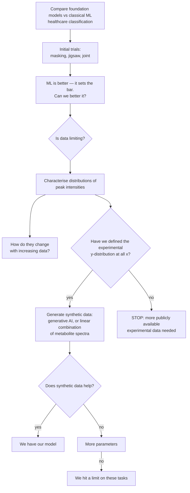

# PI's project outline (whiteboard, transcribed 2026-08-22)

Source: whiteboard photograph provided by Shankararama Sharma, 2026-08-22. This is the
governing outline for the project's scope and closure criteria. Transcribed verbatim
first, then interpreted, then mapped against what we have already established.

> **Please commit the original photograph alongside this file** (suggested path
> `docs/figures/PI_outline_whiteboard_2026-08-22.jpg`) so the transcription can always be
> checked against the source.

---

## 1. Verbatim transcription

```
- Comparing foundational models with ML
  for healthcare applications
                    -> classification

- initial trials w/ masking, jigsaw & joint
  -> ML is better - sets bar, can we better it
       |
       v
     need for more data ?  Is data limiting.

  -> distributions of peak intensities
       - how they change w/ increasing data
       - have we defined experimental y-distrib. at all x.
             |- if yes, use synthetic data,
                  generative AI or LC of metabolite spectra
             |- if no . we need more publicly available exptl data needed.

- if yes - does synthetic data help?
     |- if yes -> we have our model !
     |- if no  -  more parameters.
           |- if no, then we hit a limit on these tasks
```

## 2. Reading of the shorthand

- **"LC of metabolite spectra"** — *linear combination* of pure-metabolite reference
  spectra. i.e. synthesise a serum spectrum as a weighted sum of individual metabolite
  standards, with the weights drawn from a realistic concentration distribution. The
  alternative offered on the same line is a learned generative model.
- **"experimental y-distrib. at all x"** — the distribution of intensity (*y*) at every
  chemical-shift position (*x*). Equivalently: have we characterised
  *p(intensity | ppm)* across the corpus, well enough to sample from it.
- **"more parameters"** — scale the backbone up.
- **"sets bar"** — classical ML is the baseline the foundation model must clear, not a
  competitor to be argued around.

## 3. The decision tree



## 4. Scope note — this is a COMPARISON study

The outline's title is *"Comparing foundational models with ML"*, not *"build a foundational
model"* (which is how the February 2026 deck framed the Goal slide). Under the outline's own
framing, **a well-evidenced negative comparison is a completed deliverable**, and the tree
has an explicit negative exit ("we hit a limit on these tasks"). This matters for closure:
we are not obliged to reach node I to finish.

## 5. Status of each node against our results

| Node | Status | Evidence |
|---|---|---|
| Initial trials, masking / jigsaw / joint | ✅ done | §3, §7, §14 |
| "ML is better — sets bar" | ✅ confirmed, and it held up | §3; and after §18 + §11 removed the two apparent exceptions, the record is **0 SSL wins** on the admissible targets |
| "Can we better it?" | ✅ attempted, insufficient | Head fix +0.120 (§4b) and position-preserving pooling +0.03–0.13 (§5c) are real and paired, but do not close the gap |
| "Is data limiting?" — row count | ✅ answered: **no** | §13 (corpus size downward: no effect), §15 (the apparent corpus effect was a seed artifact) |
| "Is data limiting?" — data *diversity* | ✅ answered: **yes, this is the constraint** | §19: 86% of corpus variance in 5 PCs; 55% of rows have a neighbour at r > 0.99; 1.1% near-duplicates. §20: evaluation cohorts sit at r = 0.37–0.78 from their nearest corpus spectrum, vs r = 0.99 within-corpus. The corpus is **narrow, not small** |
| **"Distributions of peak intensities"** | ❌ **NOT DONE — the live next step** | No characterisation of *p(intensity \| ppm)* exists in this project |
| **"How they change with increasing data"** | ❌ **NOT DONE** | Convergence of that distribution vs n has never been measured |
| **"Have we defined y-distribution at all x?"** | ❌ **NOT DONE — this is the branch point** | Everything downstream depends on it |
| Synthetic data (generative / LC of metabolite spectra) | ⛔ blocked on the branch point | — |
| "Does synthetic data help?" | ⛔ blocked | — |
| "More parameters" | 🟡 **partially pre-answered: unlikely to help** | §5d backbone scaling withdrawn; capacity arms (`ps1024_d256_L6`) and patch-size sweeps all land inside the 0.045 noise floor (§15). Recommend not spending GPU here without new evidence |
| "We hit a limit on these tasks" | 🟡 currently the best-supported endpoint | §6 (few-shot, negative on all targets), §19 (mechanism) |

## 6. Where our findings and the outline converge

§19 established that masked reconstruction is **nearly free** on this corpus — copying the
most similar other spectrum scores r = 0.900 on hidden bins at 60% masking versus the
network's 0.921 — because the corpus is close to low-rank and self-redundant. The pretext
task therefore cannot force the model to learn anything disease-discriminative.

The outline's synthetic-data branch is a **direct attack on exactly that mechanism**, which
is a stronger convergence than it first appears:

- A corpus built by linear combination of metabolite standards has **known, controllable
  rank and diversity**. We could set the effective dimensionality deliberately instead of
  inheriting whatever MetaboLights happens to contain.
- That converts §19 from a diagnosis into a testable intervention: if reconstruction stops
  being solvable by copy-a-neighbour once diversity is raised, and downstream transfer
  improves with it, the mechanism is confirmed *and* fixed. If transfer stays flat while
  the pretext task gets genuinely hard, we have isolated the objective as the limit —
  which is the outline's node K, reached with a mechanism rather than by exhaustion.
- It also sidesteps §20's coverage problem: synthetic spectra can be generated to span the
  evaluation cohorts' region of spectrum space, which the current corpus does not.

## 7. Prerequisites before any node below "is data limiting" is trusted

These are integrity fixes, not new science, but every downstream number inherits them.

1. **Normalisation defect (§11).** `rowMinMax` amplifies batch-correlated signal on 2 of 5
   targets — metabolite-free spectral regions classify the label at 0.726 (MTBLS326) and
   0.640 (BrC-T2D diabetes) after per-row min–max, but not before. Per-row min–max converts
   absolute intensity into an SNR feature. **This directly contaminates any
   "distribution of peak intensities" analysis**, since that analysis *is* about intensity.
   Characterise intensity distributions on un-normalised or PQN/unit-area data.
2. **MTBLS326 is inadmissible (§11)** — confounded by design, cases = samples 1–27,
   controls = 101–130. Exclude from all reported comparisons.
3. **Barth's SSL win is retracted (§18)** — a single lucky pretraining seed.
4. **De-identify `data/BrC_T2D/BC_T2D_newlabels_metadata_mapping.csv`** — it contains
   patient names in `sample_name`.
5. **Near-duplicate dedup** before any data-scaling claim (§19: 55% at r > 0.99).
6. **Bruker raw import** (pending, user has it on local HDD) to replace identifier-based
   run-order proxies with `acqus` `##$DATE` timestamps (§11 limitation).

## 8. Implied work plan, in the outline's own order

1. **Characterise *p(intensity | ppm)* over the corpus** — the outline's live node. Per-ppm
   intensity distributions, their shape family, and their dependence on ppm region
   (baseline vs peak vs water-suppressed). On non-`rowMinMax` data.
2. **Convergence with n** — resample the corpus at increasing sizes and measure how fast
   those per-ppm distributions stabilise. This is the outline's "how they change with
   increasing data", and it is also the *correct* version of the corpus-scaling experiment
   (#17), which was previously framed in terms of downstream accuracy and would have been
   uninterpretable given the near-duplicate rate.
3. **Decide the branch point** — is the distribution defined well enough to sample from?
   Answer determines synthetic-data vs acquire-more-public-data.
4. **If synthetic: build the LC-of-metabolite-spectra generator first**, not the generative
   model. It is cheaper, fully interpretable, and gives explicit control over rank and
   diversity, which is what §19 says the corpus lacks.
5. **Re-pretrain on real + synthetic and re-evaluate**, judging the pretext task
   baseline-relative (does copy-a-neighbour still match it?) rather than by r alone.
6. **Only then consider "more parameters"**, and note §5d/§15 say the prior is poor.

## 9. Cross-references

Master analysis document: [`SSL_vs_classical_analysis.md`](SSL_vs_classical_analysis.md).
Group-meeting deck: [`Group_Meeting_2026-08-10.pptx`](Group_Meeting_2026-08-10.pptx).
