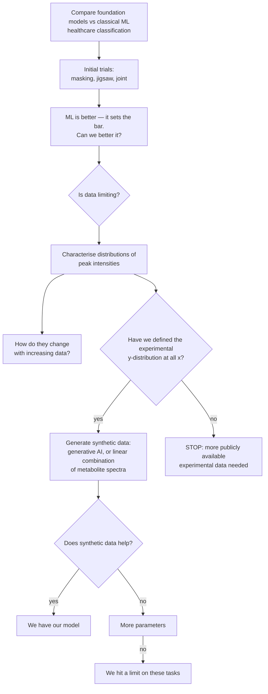

# PI's project outline (whiteboard, transcribed 2026-08-22)

Source: whiteboard photograph provided by Shankararama Sharma, 2026-08-22. This is the
governing outline for the project's scope and closure criteria. Transcribed verbatim
first, then interpreted, then mapped against what we have already established.

> **Please commit the original photograph alongside this file** (suggested path
> `docs/figures/PI_outline_whiteboard_2026-08-22.jpg`) so the transcription can always be
> checked against the source.

---

## 1. Verbatim transcription

```
- Comparing foundational models with ML
  for healthcare applications
                    -> classification

- initial trials w/ masking, jigsaw & joint
  -> ML is better - sets bar, can we better it
       |
       v
     need for more data ?  Is data limiting.

  -> distributions of peak intensities
       - how they change w/ increasing data
       - have we defined experimental y-distrib. at all x.
             |- if yes, use synthetic data,
                  generative AI or LC of metabolite spectra
             |- if no . we need more publicly available exptl data needed.

- if yes - does synthetic data help?
     |- if yes -> we have our model !
     |- if no  -  more parameters.
           |- if no, then we hit a limit on these tasks
```

## 2. Reading of the shorthand

- **"LC of metabolite spectra"** — *linear combination* of pure-metabolite reference
  spectra. i.e. synthesise a serum spectrum as a weighted sum of individual metabolite
  standards, with the weights drawn from a realistic concentration distribution. The
  alternative offered on the same line is a learned generative model.
- **"experimental y-distrib. at all x"** — the distribution of intensity (*y*) at every
  chemical-shift position (*x*). Equivalently: have we characterised
  *p(intensity | ppm)* across the corpus, well enough to sample from it.
- **"more parameters"** — scale the backbone up.
- **"sets bar"** — classical ML is the baseline the foundation model must clear, not a
  competitor to be argued around.

## 3. The decision tree



## 4. Scope note — the goal is still to BUILD the model

**Corrected 2026-08-22 by SS.** An earlier reading of this file took the outline's title
("Comparing foundational models with ML") to mean the project's deliverable is a comparison
study. That is wrong. **The goal is to build a foundational model.** The comparison framing
appears in the outline only because the discussion happened *after* the model had been
built, so comparison against classical ML was the immediate agenda item.

Consequences for how the tree is read:
- Node I ("we have our model") is the **target**, not one acceptable outcome among two.
- Node K ("we hit a limit on these tasks") is a **fallback**, admissible only once the
  synthetic-data and capacity branches have actually been tried.
- The negative results accumulated so far (§6, §11, §18, §19, §20) are therefore *interim
  findings that set up the synthetic-data branch*, not the deliverable.

## 5. Status of each node against our results

| Node | Status | Evidence |
|---|---|---|
| Initial trials, masking / jigsaw / joint | ✅ done | §3, §7, §14 |
| "ML is better — sets bar" | ✅ confirmed, and it held up | §3; and after §18 + §11 removed the two apparent exceptions, the record is **0 SSL wins** on the admissible targets |
| "Can we better it?" | ✅ attempted, insufficient | Head fix +0.120 (§4b) and position-preserving pooling +0.03–0.13 (§5c) are real and paired, but do not close the gap |
| "Is data limiting?" — row count | ✅ answered: **no** | §13 (corpus size downward: no effect), §15 (the apparent corpus effect was a seed artifact) |
| "Is data limiting?" — data *diversity* | ✅ answered: **yes, this is the constraint** | §19: 86% of corpus variance in 5 PCs; 55% of rows have a neighbour at r > 0.99; 1.1% near-duplicates. §20: evaluation cohorts sit at r = 0.37–0.78 from their nearest corpus spectrum, vs r = 0.99 within-corpus. The corpus is **narrow, not small** |
| **"Distributions of peak intensities"** | 🟡 **PARTIALLY DONE (marginals)** | `code/analysis/peak_saturation.py` → `results/analysis/peak_saturation_full_nw/`. 60 canonical peaks, 9,670 spectra. See §5a below |
| **"How they change with increasing data"** | ✅ **DONE for those 60 marginals** | Held-out KS-distance convergence curves; see §5a |
| **"Have we defined y-distribution at all x?"** | ❌ **NOT for the joint distribution — this is the real branch point** | 60 of 131,072 positions, and marginals only. §5b |
| Synthetic data (generative / LC of metabolite spectra) | ⛔ blocked on the branch point | — |
| "Does synthetic data help?" | ⛔ blocked | — |
| "More parameters" | 🟡 **partially pre-answered: unlikely to help** | §5d backbone scaling withdrawn; capacity arms (`ps1024_d256_L6`) and patch-size sweeps all land inside the 0.045 noise floor (§15). Recommend not spending GPU here without new evidence |
| "We hit a limit on these tasks" | 🟡 currently the best-supported endpoint | §6 (few-shot, negative on all targets), §19 (mechanism) |

### 5a. What the existing peak-intensity analysis established

`peak_saturation.py` detects 60 canonical peaks (water and EDTA windows excluded), takes each
peak's area per spectrum, then measures **held-out KS-distance convergence**: a fixed
reference half vs growing subsamples of a probe half, so the reference cannot leak into the
subsample. Saturation N* is where the KS curve first drops below threshold and stays there.

Result over the 60 peaks (`saturation_summary.csv`):

| metric | value |
|---|---|
| peaks that never saturated | **0 / 60** |
| peaks saturating below 25% of the probe pool | **58 / 60** |
| median saturation ratio N*/pool | **0.093** |
| median N* (spectra needed) | **365** (max 1058) |
| peaks needing > 9,670 spectra for 5% relative SEM | **0 / 60** (max needed 3,012) |
| mean / min peak detection rate | 0.776 / 0.195 |

**Reading: for the marginal distribution of an individual peak's intensity, data is NOT
limiting.** Roughly 400 spectra pin the distribution shape; 9,670 is 10–25× more than
needed. This is a real, already-earned answer to the outline's "is data limiting?" node.

Two caveats that must be cleared before this drives the branch decision:

1. **It ran on the pre-v4 corpus.** `run_config.json` records
   `combine_unique_MetaboLights_Workbench_Water_EDTA_Suppressed_rowMinMax.npy` (unversioned),
   whose contents differ from the `_v4` array now used everywhere else — i.e. it predates the
   EDTA-cutoff fix. Re-run on v4 before quoting.
2. **It ran on rowMinMax data**, so "intensity" here means *height relative to that
   spectrum's tallest peak*. See §7.1 — the normaliser defines what the distribution is a
   distribution *of*.

### 5b. The gap that actually blocks the branch: marginals vs the joint distribution

The outline asks whether the experimental y-distribution is defined **at all x**. What exists
is 60 **marginal** distributions at 60 x-positions. Generation needs the **joint**
distribution, and SS's own note (route *b* in §8) identifies exactly why: adjacent points
cannot be sampled independently or the result is not an NMR spectrum.

We already have a strong measurement of that joint structure, from §19/§20 of the master doc:

- 86% of corpus variance sits in **5 principal components**; 95% in 20.
- The median spectrum's nearest neighbour in the corpus correlates at **r = 0.991**; 55% of
  rows have a neighbour above 0.99 and 1.1% are near-duplicates above 0.9999.
- The evaluation cohorts sit at **r = 0.37–0.78** from their nearest corpus spectrum.

So the two halves of the picture point in opposite directions, and both are true:

> **The marginals are saturated. The joint distribution is extremely narrow, and it does not
> cover the cohorts we evaluate on.**

That combination is what determines whether each synthetic-data route can help — see §8.

## 6. Where our findings and the outline converge

§19 established that masked reconstruction is **nearly free** on this corpus — copying the
most similar other spectrum scores r = 0.900 on hidden bins at 60% masking versus the
network's 0.921 — because the corpus is close to low-rank and self-redundant. The pretext
task therefore cannot force the model to learn anything disease-discriminative.

The outline's synthetic-data branch is a **direct attack on exactly that mechanism**, which
is a stronger convergence than it first appears:

- A corpus built by linear combination of metabolite standards has **known, controllable
  rank and diversity**. We could set the effective dimensionality deliberately instead of
  inheriting whatever MetaboLights happens to contain.
- That converts §19 from a diagnosis into a testable intervention: if reconstruction stops
  being solvable by copy-a-neighbour once diversity is raised, and downstream transfer
  improves with it, the mechanism is confirmed *and* fixed. If transfer stays flat while
  the pretext task gets genuinely hard, we have isolated the objective as the limit —
  which is the outline's node K, reached with a mechanism rather than by exhaustion.
- It also sidesteps §20's coverage problem: synthetic spectra can be generated to span the
  evaluation cohorts' region of spectrum space, which the current corpus does not.

## 7. Prerequisites before any node below "is data limiting" is trusted

These are integrity fixes, not new science, but every downstream number inherits them.

1. **Normalisation: the principle is right, the operator is the question.** SS's point
   (2026-08-22) is correct and accepted: NMR intensities are relative, conventionally
   referenced to a standard at 0 ppm, so **per-spectrum normalisation is necessary**. The open
   issue is narrower. What the pipeline actually applies is not reference normalisation but
   min–max — `code/preprocessing/row_minmax_normalize.py`:

   ```python
   normalized = (spectrum - spectrum.min()) / (spectrum.max() - spectrum.min())
   ```

   The zero point is therefore the spectrum's **noise-floor minimum** and the unit is its
   **tallest peak**, whichever peak that happens to be — neither is a chemical reference. A
   side effect is that noise amplitude becomes expressed as a fraction of peak height, i.e.
   an SNR feature, and SNR is an acquisition property (scan count, receiver gain, probe
   tuning). That is consistent with what §11 measured: metabolite-free regions became **more**
   label-predictive after rowMinMax (MTBLS326 0.641 → 0.726; BrC-T2D diabetes 0.551 → 0.640).

   Reference-peak normalisation (divide by the 0 ppm standard's integral) and PQN both keep
   relative quantification without anchoring the scale to the noise floor and the max peak.
   Neither is implemented today; no PQN or reference-peak normaliser exists in
   `code/preprocessing/`.

   **Settle it by measurement, not argument:** re-run `batch_confound_audit.py` under
   min–max, reference-peak and PQN. If the metabolite-free-region leak disappears under the
   latter two and persists under min–max, that is decisive. This matters most for the live
   node, because the normaliser defines what "distribution of peak intensities" is a
   distribution *of*.
2. **MTBLS326 is inadmissible (§11)** — confounded by design, cases = samples 1–27,
   controls = 101–130. Exclude from all reported comparisons.
3. **Barth's SSL win is retracted (§18)** — a single lucky pretraining seed.
4. **De-identify `data/BrC_T2D/BC_T2D_newlabels_metadata_mapping.csv`** — it contains
   patient names in `sample_name`.
5. **Near-duplicate dedup** before any data-scaling claim (§19: 55% at r > 0.99).
6. **Bruker raw import** (pending, user has it on local HDD) to replace identifier-based
   run-order proxies with `acqus` `##$DATE` timestamps (§11 limitation).

## 8. Synthetic-data routes (decided with the PI, 2026-08-22)

SS reports two routes agreed with the PI:

**(a) GAN trained on the available corpus (9,670 spectra).**

**(b) Sample from the per-x-position intensity distribution — with *dependent* sampling.**
Independent per-point sampling cannot produce an NMR-like spectrum because adjacent points
would be disjointed; instead sample small windows and continue with **overlapping windows**.

Assessment against §5b, which is the constraint both routes have to beat:

| | adds realism | adds **diversity / coverage** | preserves metabolite coupling |
|---|---|---|---|
| (a) GAN on the corpus | yes | **no — this is the problem** | yes (learned) |
| (b) overlapping-window sampling | partly | **yes, but by breaking long-range structure** | **no** |
| (c) LC of metabolite spectra *(on the whiteboard, not yet selected)* | yes | **yes, by construction** | **yes, exactly** |

- **(a)** A GAN can at best reproduce the distribution it was fitted to. Given that
  distribution is ~5–20 effective dimensions and 55% near-duplicate (§19), and does not
  reach the evaluation cohorts (§20), GAN samples will populate the *same thin manifold more
  densely*. That adds volume, not coverage, and does not make the pretext task harder — which
  is what §19 says is required. Mode collapse would make it strictly worse. Route (a) is a
  realism/augmentation tool, not a fix for the diagnosed limitation.
- **(b)** The dependence insight is right and important. Note what stitching independent
  overlapping windows actually does: it **breaks long-range correlations**, so it does move
  samples off the corpus manifold — genuinely increasing diversity. But the correlations it
  breaks include the physical constraint that *all multiplets of one metabolite scale
  together with its concentration*. The output can therefore be chemically impossible (one
  glucose multiplet high, another low). For learning local lineshape and J-structure that may
  be acceptable; it will not teach metabolite co-variation, which is where disease signal
  lives.
- **(c)** Linear combination of pure-metabolite reference spectra is the one route that gets
  both: multiplet patterns scale together by construction (coupling preserved), while the
  concentration priors are ours to set, so effective rank and diversity are **explicit
  knobs** rather than inherited. It is also the cheapest to build and fully interpretable.
  Recommended as a third route, not a replacement — it is already on the PI's whiteboard.

### 8a. Acceptance test any generator must pass (tooling already exists)

Do not judge synthetic spectra by eye or by discriminator loss. Judge them with the §19/§20
machinery, which is already written:

1. **Effective rank rises** — `reconstruction_baselines.py --redundancy-sample` on the
   synthetic corpus: does variance stop concentrating in 5 PCs? Does the median
   nearest-neighbour r fall below 0.99?
2. **The pretext task gets harder** — `reconstruction_baselines.py`: does copy-a-neighbour
   stop matching the network (currently 0.900 vs 0.921 at 60% masking)? If a non-learned
   baseline still ties the model, the synthetic data has not fixed anything.
3. **Coverage improves** — `pretrain_eval_overlap.py`: does the evaluation cohorts' nearest
   neighbour in the (real + synthetic) corpus rise from 0.37–0.78 toward the 0.99 seen
   within-corpus?

A generator that fails all three cannot help downstream, regardless of how real its output
looks.

## 9. Implied work plan, in the outline's own order

0. **Settle the normaliser** (§7.1) — three-way batch audit under min–max / reference-peak /
   PQN. Cheap, and it defines what every intensity distribution below is measured on.
1. **Re-run `peak_saturation.py` on the v4 corpus** under the chosen normaliser. The existing
   result is on the pre-v4 array (§5a caveat 1) and should not carry the branch decision.
2. **Extend from 60 marginals to the joint structure** (§5b) — this is the actual gap. Two
   concrete pieces: per-window joint distributions at the window size route (b) will sample
   (so the estimate matches the generator), and the correlation-length structure of the
   spectrum (how far does intensity dependence extend?), which sets the overlap the
   sliding-window scheme needs.
3. **Decide the branch point** on the joint, not the marginals.
4. **Build generators, cheapest-first**: LC of metabolite spectra (c), then the
   overlapping-window sampler (b), then the GAN (a). Each gated by the §8a acceptance test
   before any GPU is spent on pretraining with it.
5. **Re-pretrain on real + synthetic and re-evaluate**, judging the pretext task
   baseline-relative (does copy-a-neighbour still match it?) rather than by r alone.
6. **Only then consider "more parameters"**, and note §5d/§15 say the prior is poor.

## 9. Cross-references

Master analysis document: [`SSL_vs_classical_analysis.md`](SSL_vs_classical_analysis.md).
Group-meeting deck: [`Group_Meeting_2026-08-10.pptx`](Group_Meeting_2026-08-10.pptx).
