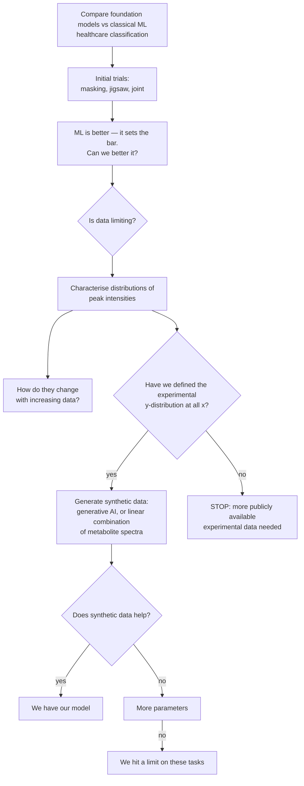

# PI's project outline (whiteboard, transcribed 2026-08-22)

Source: whiteboard photograph provided by Shankararama Sharma, 2026-08-22. This is the
governing outline for the project's scope and closure criteria. Transcribed verbatim
first, then interpreted, then mapped against what we have already established.

> **Please commit the original photograph alongside this file** (suggested path
> `docs/figures/PI_outline_whiteboard_2026-08-22.jpg`) so the transcription can always be
> checked against the source.

---

## 1. Verbatim transcription

```
- Comparing foundational models with ML
  for healthcare applications
                    -> classification

- initial trials w/ masking, jigsaw & joint
  -> ML is better - sets bar, can we better it
       |
       v
     need for more data ?  Is data limiting.

  -> distributions of peak intensities
       - how they change w/ increasing data
       - have we defined experimental y-distrib. at all x.
             |- if yes, use synthetic data,
                  generative AI or LC of metabolite spectra
             |- if no . we need more publicly available exptl data needed.

- if yes - does synthetic data help?
     |- if yes -> we have our model !
     |- if no  -  more parameters.
           |- if no, then we hit a limit on these tasks
```

## 2. Reading of the shorthand

- **"LC of metabolite spectra"** — *linear combination* of pure-metabolite reference
  spectra. i.e. synthesise a serum spectrum as a weighted sum of individual metabolite
  standards, with the weights drawn from a realistic concentration distribution. The
  alternative offered on the same line is a learned generative model.
- **"experimental y-distrib. at all x"** — the distribution of intensity (*y*) at every
  chemical-shift position (*x*). Equivalently: have we characterised
  *p(intensity | ppm)* across the corpus, well enough to sample from it.
- **"more parameters"** — scale the backbone up.
- **"sets bar"** — classical ML is the baseline the foundation model must clear, not a
  competitor to be argued around.

## 3. The decision tree



## 4. Scope note — the goal is still to BUILD the model

**Corrected 2026-08-22 by SS.** An earlier reading of this file took the outline's title
("Comparing foundational models with ML") to mean the project's deliverable is a comparison
study. That is wrong. **The goal is to build a foundational model.** The comparison framing
appears in the outline only because the discussion happened *after* the model had been
built, so comparison against classical ML was the immediate agenda item.

Consequences for how the tree is read:
- Node I ("we have our model") is the **target**, not one acceptable outcome among two.
- Node K ("we hit a limit on these tasks") is a **fallback**, admissible only once the
  synthetic-data and capacity branches have actually been tried.
- The negative results accumulated so far (§6, §11, §18, §19, §20) are therefore *interim
  findings that set up the synthetic-data branch*, not the deliverable.

## 5. Status of each node against our results

| Node | Status | Evidence |
|---|---|---|
| Initial trials, masking / jigsaw / joint | ✅ done | §3, §7, §14 |
| "ML is better — sets bar" | ✅ confirmed, and it held up | §3; and after §18 + §11 removed the two apparent exceptions, the record is **0 SSL wins** on the admissible targets |
| "Can we better it?" | ✅ attempted, insufficient | Head fix +0.120 (§4b) and position-preserving pooling +0.03–0.13 (§5c) are real and paired, but do not close the gap |
| "Is data limiting?" — row count | ✅ answered: **no** | §13 (corpus size downward: no effect), §15 (the apparent corpus effect was a seed artifact) |
| "Is data limiting?" — data *diversity* | ✅ answered: **yes, this is the constraint** | §19: 86% of corpus variance in 5 PCs; 55% of rows have a neighbour at r > 0.99; 1.1% near-duplicates. §20: evaluation cohorts sit at r = 0.37–0.78 from their nearest corpus spectrum, vs r = 0.99 within-corpus. The corpus is **narrow, not small** |
| **"Distributions of peak intensities"** | 🟡 **PARTIALLY DONE (marginals)** | `code/analysis/peak_saturation.py` → `results/analysis/peak_saturation_full_nw/`. 60 canonical peaks, 9,670 spectra. See §5a below |
| **"How they change with increasing data"** | ✅ **DONE for those 60 marginals** | Held-out KS-distance convergence curves; see §5a |
| **"Have we defined y-distribution at all x?"** | ❌ **NOT for the joint distribution — this is the real branch point** | 60 of 131,072 positions, and marginals only. §5b |
| Synthetic data (generative / LC of metabolite spectra) | ⛔ blocked on the branch point | — |
| "Does synthetic data help?" | ⛔ blocked | — |
| "More parameters" | 🟡 **partially pre-answered: unlikely to help** | §5d backbone scaling withdrawn; capacity arms (`ps1024_d256_L6`) and patch-size sweeps all land inside the 0.045 noise floor (§15). Recommend not spending GPU here without new evidence |
| "We hit a limit on these tasks" | 🟡 currently the best-supported endpoint | §6 (few-shot, negative on all targets), §19 (mechanism) |

### 5a. What the existing peak-intensity analysis established

`peak_saturation.py` detects 60 canonical peaks (water and EDTA windows excluded), takes each
peak's area per spectrum, then measures **held-out KS-distance convergence**: a fixed
reference half vs growing subsamples of a probe half, so the reference cannot leak into the
subsample. Saturation N* is where the KS curve first drops below threshold and stays there.

Result over the 60 peaks (`saturation_summary.csv`):

| metric | value |
|---|---|
| peaks that never saturated | **0 / 60** |
| peaks saturating below 25% of the probe pool | **58 / 60** |
| median saturation ratio N*/pool | **0.093** |
| median N* (spectra needed) | **365** (max 1058) |
| peaks needing > 9,670 spectra for 5% relative SEM | **0 / 60** (max needed 3,012) |
| mean / min peak detection rate | 0.776 / 0.195 |

**Reading: for the marginal distribution of an individual peak's intensity, data is NOT
limiting.** Roughly 400 spectra pin the distribution shape; 9,670 is 10–25× more than
needed. This is a real, already-earned answer to the outline's "is data limiting?" node.

### 5a-bis. Re-run on v4 under `unit_area` (2026-08-22) — the result replicates

Both caveats above are now cleared. Runs, all 60 peaks / 9,670 spectra / NW alignment:

| run | median KS ratio | unsaturated /60 | median N* | mean detection |
|---|---|---|---|---|
| original: pre-v4 + rowMinMax, panel re-picked | 0.093 | 0 | 364 | 0.776 |
| v4 + rowMinMax, panel re-picked | 0.093 | 0 | 364 | 0.776 |
| v4 + `unit_area`, panel re-picked | **0.142** | **6** | 374 | **0.538** |
| **v4 + `unit_area`, panel HELD FIXED** | **0.090** | **1** | **363** | **0.776** |

**Conclusion: the marginal-saturation finding is robust.** On v4, under the measurement
unit the PI's node actually needs, ~360 spectra pin each peak's distribution shape and
9,670 is roughly 10× more than required. Data is **not** limiting for marginals.

**But the third row is a trap worth recording,** because taken at face value it would have
reversed the conclusion (6 peaks unsaturated, detection collapsing to 0.538). It is an
artifact of the analysis, not of the unit:

> The canonical panel is selected from prominences of the **median reference spectrum**, and
> the normaliser changes which spectra dominate that median. Measured here, v4+`unit_area`
> and v4+`rowminmax` share only **9 of 60** picked positions; even the *same* normaliser on
> pre-v4 vs v4 shares only **14 of 60**. So re-picking per condition varies the panel and the
> measurement unit simultaneously, and the comparison is meaningless.

Fixed by adding **`--peaks-from`** to `peak_extraction.py`, which reuses a stored panel. With
the panel held fixed, detection rate is *identical* (0.776 both) — confirming the SNR
detection gate is scale-invariant as expected — and only the distribution values change.

**Rule going forward: any comparison across normalisers, corpus versions or preprocessing
must pass `--peaks-from`.** Otherwise the panel silently becomes a second variable.

Artifacts:
`results/analysis/peak_saturation_v4_unitarea_fixedpanel/` (the result to quote),
`peak_saturation_v4_rowminmax/` (control), `peak_saturation_v4_unitarea/` (free-panel,
retained only as the counter-example).

### 5c. RESULT (2026-08-22): the joint distribution, measured

Script: `code/analysis/joint_distribution.py` →
`results/analysis/joint_distribution/`. 2,000 spectra, `unit_area`, binned to 4,096.

**Across-spectra correlation does not decay within any feasible window.**

| separation | 32 pts | 1,024 pts | 16,384 (1.5 ppm) | 65,536 (6 ppm) |
|---|---|---|---|---|
| across-spectra mean \|r\| | 0.946 | 0.727 | 0.568 | 0.450 |
| within-spectrum autocorr | 0.792 | 0.122 | 0.050 | −0.022 |

It first falls below 0.5 only at ~2.2 ppm, and **never reaches 0.3 anywhere inside the
spectrum**. The within-spectrum autocorrelation (lineshape width) dies by ~1,000 points, so
the two are completely different scales — conflating them would have suggested a ~1,000-point
window suffices.

**It is not one global factor.** Removing leading principal components barely dents it:
\|r\| at 6 ppm goes 0.450 → 0.468 (1 PC) → 0.465 (2) → 0.374 (5), even though PC1 alone holds
43% of variance. So this is genuinely distributed composition covariance — the metabolite
coupling SS predicted, where all multiplets of a molecule move together.

**Per-window structure is cheap.** Median PCs for 95% of a window's variance: 1 (128 pts),
1 (512), **2 (1,024)**, 3 (2,048) — worst window 12. With 9,670 spectra that is ~1,000
spectra per component. The local model is easy; the long-range model is the hard part.

> **Consequence for route (b): no overlap setting makes window-stitching lossless.**
> Beyond a 1,024-point window, mean \|r\| is still 0.597 and 99.8% of lags exceed 0.3.
> Independent windows must break real structure. The cost is now a number, not an assumption.

**Bug worth recording:** the first run reported "1 PC for 95%" at every window size. The
spectrum midpoint (65,536) sits inside the zeroed water-suppression window, so the centre
probe window was all zeros and the SVD degenerate. Windows are now tiled across the
0.5–9.5 ppm signal region and degenerate windows are skipped.

### 5d. RESULT: windowed synthesis built and validated

Scripts: `code/analysis/synthesise_windowed.py`,
`code/plotting/plot_synthetic_windowed.py` → `results/analysis/synthetic_windowed/`,
`results/plots/synthetic_windowed/`. Window 2,048, hop 1,024 (50% overlap), Hann crossfade,
600 donors, n=100 synthetic per method.

| method | nn *r* to real | \|r\| @0.09 ppm | \|r\| @1.5 ppm | \|r\| @6 ppm | PCs 95% |
|---|---|---|---|---|---|
| **real corpus** (n=100 subsample) | — | 0.717 | 0.561 | 0.453 | **27** |
| `quilted_base` | **0.982** | 0.770 | 0.540 | **0.401** | 18 |
| `quilted` | 0.862 | 0.777 | 0.575 | **0.051** | 33 |
| `independent` | **0.752** | **0.198** | **0.084** | **0.075** | 46 |

- `independent` (a fresh random donor per window) destroys correlation at **every** scale —
  0.198 vs 0.717 even at 0.09 ppm. Confirms SS's objection quantitatively.
- `quilted` (donor chosen to match the overlap region) recovers local and mid-range structure
  (0.777 / 0.575, essentially real) but **long-range collapses to 0.051**. Exactly the
  predicted failure: metabolite coupling across the spectrum is not preserved.
- `quilted_base` (donors restricted to a globally similar pool) is the only variant that
  keeps long-range structure (0.401 vs 0.453 real) — but at nn *r* = **0.982**, i.e. it is
  very nearly copying a real spectrum, so it adds little.

> **The trade-off IS the finding: novelty and long-range fidelity pull directly against each
> other under window sampling.** This follows from §5c — if correlation never decays, then
> any recombination that is novel at long range is also wrong at long range. Route (b) alone
> cannot produce spectra that are both new and chemically coherent.

**Two measurement traps found and fixed**, both of which would have flattered the method:
effective rank is capped at n−1, so the real corpus must be subsampled to the same n (at
n=8 the first run showed "3 PCs vs 46" and looked like diversity collapse); and correlation
estimates from n=8 are unstable, so validation now defaults to n=100.

**Also worth saying plainly: all three variants look like plausible NMR spectra.** Even
`independent`, whose statistics are destroyed, has sharp peaks, a flat baseline and peaks in
the right ppm regions — because a 50% Hann crossfade hides the joins. **Visual inspection
cannot validate a generator here**, which is precisely why the §8a acceptance test exists.

**Implication for the plan.** This strengthens the case for route (c), LC of metabolite
spectra: it is the only proposed route where long-range coupling is preserved *by
construction* (a metabolite's multiplets scale together because they are one basis vector)
while concentrations — hence diversity — are set freely. Route (b) is usable as local
augmentation on top of a coherent base, not as a stand-alone generator.

### 5b. The gap that actually blocks the branch: marginals vs the joint distribution

The outline asks whether the experimental y-distribution is defined **at all x**. What exists
is 60 **marginal** distributions at 60 x-positions. Generation needs the **joint**
distribution, and SS's own note (route *b* in §8) identifies exactly why: adjacent points
cannot be sampled independently or the result is not an NMR spectrum.

We already have a strong measurement of that joint structure, from §19/§20 of the master doc:

- 86% of corpus variance sits in **5 principal components**; 95% in 20.
- The median spectrum's nearest neighbour in the corpus correlates at **r = 0.991**; 55% of
  rows have a neighbour above 0.99 and 1.1% are near-duplicates above 0.9999.
- The evaluation cohorts sit at **r = 0.37–0.78** from their nearest corpus spectrum.

So the two halves of the picture point in opposite directions, and both are true:

> **The marginals are saturated. The joint distribution is extremely narrow, and it does not
> cover the cohorts we evaluate on.**

That combination is what determines whether each synthetic-data route can help — see §8.

## 6. Where our findings and the outline converge

§19 established that masked reconstruction is **nearly free** on this corpus — copying the
most similar other spectrum scores r = 0.900 on hidden bins at 60% masking versus the
network's 0.921 — because the corpus is close to low-rank and self-redundant. The pretext
task therefore cannot force the model to learn anything disease-discriminative.

The outline's synthetic-data branch is a **direct attack on exactly that mechanism**, which
is a stronger convergence than it first appears:

- A corpus built by linear combination of metabolite standards has **known, controllable
  rank and diversity**. We could set the effective dimensionality deliberately instead of
  inheriting whatever MetaboLights happens to contain.
- That converts §19 from a diagnosis into a testable intervention: if reconstruction stops
  being solvable by copy-a-neighbour once diversity is raised, and downstream transfer
  improves with it, the mechanism is confirmed *and* fixed. If transfer stays flat while
  the pretext task gets genuinely hard, we have isolated the objective as the limit —
  which is the outline's node K, reached with a mechanism rather than by exhaustion.
- It also sidesteps §20's coverage problem: synthetic spectra can be generated to span the
  evaluation cohorts' region of spectrum space, which the current corpus does not.

## 7. Prerequisites before any node below "is data limiting" is trusted

These are integrity fixes, not new science, but every downstream number inherits them.

1. **Normalisation: RESOLVED 2026-08-22 — keep rowMinMax, with three narrow caveats.**
   Script: `code/analysis/normaliser_comparison.py` →
   `results/analysis/normaliser_comparison/normaliser_comparison.csv`.

   SS's position was that per-spectrum normalisation is chemically necessary and that
   min–max is best suited to DNN training. **Tested on all five targets against `none`,
   `unit_area` and `pqn`, that position holds.** My earlier framing — that rowMinMax is a
   defect to be removed — was wrong, and is retracted here.

   Signal-free accuracy (metabolite-free regions; *lower* = less non-biological signal) and
   full-spectrum classical accuracy (must not degrade):

   | cohort | signal-free: none / rowminmax / unit_area / pqn | full-spectrum: none / rowminmax / unit_area / pqn |
   |---|---|---|
   | Barth | 0.259 / **0.497** / 0.311 / 0.231 | 0.814 / **0.705** / 0.748 / 0.820 |
   | MTBLS326 | 0.641 / **0.726*** / **0.763*** / **0.763*** | 0.930 / 1.000 / 0.981 / 0.981 |
   | MTBLS563 | 0.380 / 0.376 / 0.312 / 0.385* | 0.609 / **0.687** / 0.647 / **0.365** |
   | BrC-T2D cancer | **0.605*** / 0.574 / 0.562 / 0.524 | 0.911 / **0.949** / 0.923 / 0.923 |
   | BrC-T2D diabetes | 0.551 / **0.640*** / 0.582 / 0.564 | 0.754 / 0.803 / **0.814** / 0.785 |
   | **leaks (p<0.05)** | 1/5 / **2/5** / 1/5 / 1/5 | — |
   | **mean accuracy** | — | 0.803 / **0.829** / 0.823 / 0.775 |

   \* = signal-free p < 0.05.

   **Four findings, two of which go against my earlier claim.**

   a. **Changing the normaliser does not remove the leaks.** MTBLS326 leaks under *every*
      normaliser, and **worse** under `unit_area`/`pqn` (0.763) than under rowMinMax (0.726).
      That is exactly what §11 concluded on other grounds: MTBLS326 is confounded **by
      design**, and no preprocessing choice can fix a design confound. My implication that a
      normaliser change would clean this up was wrong.

   b. **rowMinMax has the best mean classical accuracy (0.829)** of the four, and by a clear
      margin over `pqn` (0.775). SS's preference is not merely a convenience argument.

   c. **`pqn` is not viable as implemented.** It destroys MTBLS563 (0.687 → **0.365**, near
      chance on a 3-class task) and its raw range is
      [−2.4e8, 4.1e7] — the median-quotient denominator goes near zero. Dropped.

   d. **The one leak that IS normaliser-specific is BrC-T2D diabetes**: 0.640 (p < 0.001)
      under rowMinMax versus 0.551 (p = 0.17) `none`, 0.582 (p = 0.14) `unit_area`, 0.564
      (p = 0.20) `pqn`. So the SNR mechanism is real, but it is confined to one target rather
      than being a pipeline-wide defect.

   **On DNN training, SS is right and the margin is large.** Numeric range after each
   normaliser plus one global scale factor:

   | normaliser | range after global scale | fraction > 1 |
   |---|---|---|
   | rowminmax | **[0.00, 1.15]** | 0.10% |
   | unit_area | [−1.02, 6.41] | 0.10% |
   | none | [−0.64, 1.89] | 0.10% |
   | pqn | [−87.2, 14.7] | 0.10% |

   Note also that the *input* scale matters less than it appears: `trainer_revised.py` puts
   `nn.LayerNorm(d_model)` immediately after the patch embedding and uses `norm_first=True`,
   so input scale is normalised away in the first block. The genuine exposure is the **MSE
   target**, which is computed on raw values — and there rowMinMax's bounded [0,1] range is a
   real advantage, since unbounded heavy-tailed targets would let the tallest peaks dominate
   the gradient.

   **Decision.**
   - **Keep rowMinMax for pretraining and for the reported evaluation.** Best accuracy, best
     conditioned targets, and the leak it causes is confined to one target.
   - **Caveat 1 — Barth's classical baseline is understated.** rowMinMax gives 0.705 (the
     §3 reported number, reproduced exactly here), but `none` gives 0.814 and `pqn` 0.820.
     Barth is the target where the SSL-vs-classical margin was closest, so this **widens** the
     gap against SSL rather than narrowing it. Report the range.
   - **Caveat 2 — treat BrC-T2D diabetes' signal-free result as a rowMinMax artifact** and
     re-check that target under `unit_area`, where it does not leak.
   - **Caveat 3 — do NOT use rowMinMax for the intensity-distribution work (§5, §9).** Under
     min–max, "intensity" means *fraction of this spectrum's tallest peak*, and the
     diagnostics show that peak is **21 distinct chemical positions across 400 spectra**, and
     lies below 0.5 ppm — where no metabolite resonates — in **19%** of them. As a unit for a
     distribution of peak intensities that is not well defined. Use `unit_area` there.
   - **There is no 0 ppm reference resonance in this corpus** (0 ppm window holds a median
     0.7% of each spectrum's global max; 0% of spectra exceed 5%), so reference-peak
     normalisation — the convention rowMinMax is sometimes assumed to stand in for — is not
     implementable here at all.

   **Implementation gotcha if any alternative normaliser is ever used:**
   `NMRSpectraDataset(..., normalize_input=True)` applies per-spectrum min–max *again* at
   training time (`trainer_revised.py` line ~50). That is idempotent on already-min–maxed
   data, which is why it has been harmless, but it would silently undo `unit_area` or `pqn`.
   Set `normalize_input=False` when feeding anything else.

2. **MTBLS326 is inadmissible (§11)** — confounded by design, cases = samples 1–27,
   controls = 101–130. Exclude from all reported comparisons.
3. **Barth's SSL win is retracted (§18)** — a single lucky pretraining seed.
4. **De-identify `data/BrC_T2D/BC_T2D_newlabels_metadata_mapping.csv`** — it contains
   patient names in `sample_name`.
5. **Near-duplicate dedup** before any data-scaling claim (§19: 55% at r > 0.99).
6. **Bruker raw import** (pending, user has it on local HDD) to replace identifier-based
   run-order proxies with `acqus` `##$DATE` timestamps (§11 limitation).

## 8. Synthetic-data routes (decided with the PI, 2026-08-22)

SS reports two routes agreed with the PI:

**(a) GAN trained on the available corpus (9,670 spectra).**

**(b) Sample from the per-x-position intensity distribution — with *dependent* sampling.**
Independent per-point sampling cannot produce an NMR-like spectrum because adjacent points
would be disjointed; instead sample small windows and continue with **overlapping windows**.

Assessment against §5b, which is the constraint both routes have to beat:

| | adds realism | adds **diversity / coverage** | preserves metabolite coupling |
|---|---|---|---|
| (a) GAN on the corpus | yes | **no — this is the problem** | yes (learned) |
| (b) overlapping-window sampling | partly | **yes, but by breaking long-range structure** | **no** |
| (c) LC of metabolite spectra *(on the whiteboard, not yet selected)* | yes | **yes, by construction** | **yes, exactly** |

- **(a)** A GAN can at best reproduce the distribution it was fitted to. Given that
  distribution is ~5–20 effective dimensions and 55% near-duplicate (§19), and does not
  reach the evaluation cohorts (§20), GAN samples will populate the *same thin manifold more
  densely*. That adds volume, not coverage, and does not make the pretext task harder — which
  is what §19 says is required. Mode collapse would make it strictly worse. Route (a) is a
  realism/augmentation tool, not a fix for the diagnosed limitation.
- **(b)** The dependence insight is right and important. Note what stitching independent
  overlapping windows actually does: it **breaks long-range correlations**, so it does move
  samples off the corpus manifold — genuinely increasing diversity. But the correlations it
  breaks include the physical constraint that *all multiplets of one metabolite scale
  together with its concentration*. The output can therefore be chemically impossible (one
  glucose multiplet high, another low). For learning local lineshape and J-structure that may
  be acceptable; it will not teach metabolite co-variation, which is where disease signal
  lives.
- **(c)** Linear combination of pure-metabolite reference spectra is the one route that gets
  both: multiplet patterns scale together by construction (coupling preserved), while the
  concentration priors are ours to set, so effective rank and diversity are **explicit
  knobs** rather than inherited. It is also the cheapest to build and fully interpretable.
  Recommended as a third route, not a replacement — it is already on the PI's whiteboard.

### 8a. Acceptance test any generator must pass (tooling already exists)

Do not judge synthetic spectra by eye or by discriminator loss. Judge them with the §19/§20
machinery, which is already written:

1. **Effective rank rises** — `reconstruction_baselines.py --redundancy-sample` on the
   synthetic corpus: does variance stop concentrating in 5 PCs? Does the median
   nearest-neighbour r fall below 0.99?
2. **The pretext task gets harder** — `reconstruction_baselines.py`: does copy-a-neighbour
   stop matching the network (currently 0.900 vs 0.921 at 60% masking)? If a non-learned
   baseline still ties the model, the synthetic data has not fixed anything.
3. **Coverage improves** — `pretrain_eval_overlap.py`: does the evaluation cohorts' nearest
   neighbour in the (real + synthetic) corpus rise from 0.37–0.78 toward the 0.99 seen
   within-corpus?

A generator that fails all three cannot help downstream, regardless of how real its output
looks.

## 9. Implied work plan, in the outline's own order

0. ~~Settle the normaliser~~ — **DONE (§7.1): keep rowMinMax, use `unit_area` for the
   intensity-distribution work only.**
1. **Re-run `peak_saturation.py` on the v4 corpus under `unit_area`.** The existing result is
   on the pre-v4 array *and* on rowMinMax, whose unit is not a well-defined chemical quantity
   (§7.1 caveat 3). This is now the first live task.
2. **Extend from 60 marginals to the joint structure** (§5b) — this is the actual gap. Two
   concrete pieces: per-window joint distributions at the window size route (b) will sample
   (so the estimate matches the generator), and the correlation-length structure of the
   spectrum (how far does intensity dependence extend?), which sets the overlap the
   sliding-window scheme needs.
3. **Decide the branch point** on the joint, not the marginals.
4. **Build generators, cheapest-first**: LC of metabolite spectra (c), then the
   overlapping-window sampler (b), then the GAN (a). Each gated by the §8a acceptance test
   before any GPU is spent on pretraining with it.
5. **Re-pretrain on real + synthetic and re-evaluate**, judging the pretext task
   baseline-relative (does copy-a-neighbour still match it?) rather than by r alone.
6. **Only then consider "more parameters"**, and note §5d/§15 say the prior is poor.

## 9. Cross-references

Master analysis document: [`SSL_vs_classical_analysis.md`](SSL_vs_classical_analysis.md).
Group-meeting deck: [`Group_Meeting_2026-08-10.pptx`](Group_Meeting_2026-08-10.pptx).
