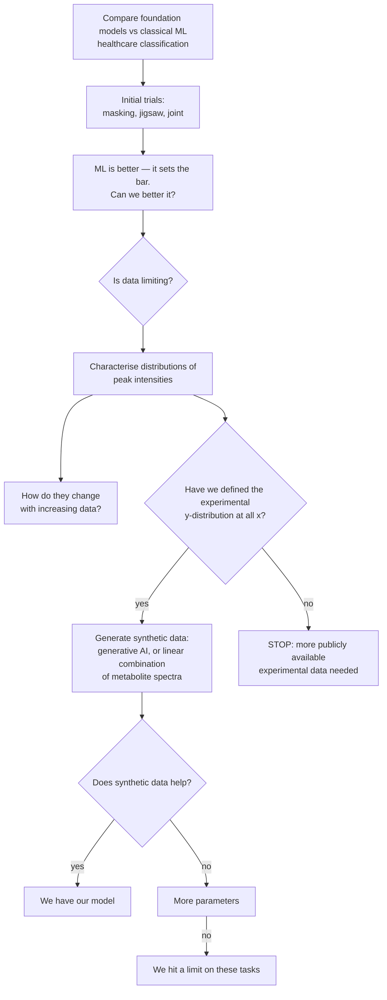

# PI's project outline (whiteboard, transcribed 2026-08-22)

Source: whiteboard photograph provided by Shankararama Sharma, 2026-08-22. This is the
governing outline for the project's scope and closure criteria. Transcribed verbatim
first, then interpreted, then mapped against what we have already established.

> **Please commit the original photograph alongside this file** (suggested path
> `docs/figures/PI_outline_whiteboard_2026-08-22.jpg`) so the transcription can always be
> checked against the source.

---

## 1. Verbatim transcription

```
- Comparing foundational models with ML
  for healthcare applications
                    -> classification

- initial trials w/ masking, jigsaw & joint
  -> ML is better - sets bar, can we better it
       |
       v
     need for more data ?  Is data limiting.

  -> distributions of peak intensities
       - how they change w/ increasing data
       - have we defined experimental y-distrib. at all x.
             |- if yes, use synthetic data,
                  generative AI or LC of metabolite spectra
             |- if no . we need more publicly available exptl data needed.

- if yes - does synthetic data help?
     |- if yes -> we have our model !
     |- if no  -  more parameters.
           |- if no, then we hit a limit on these tasks
```

## 2. Reading of the shorthand

- **"LC of metabolite spectra"** — *linear combination* of pure-metabolite reference
  spectra. i.e. synthesise a serum spectrum as a weighted sum of individual metabolite
  standards, with the weights drawn from a realistic concentration distribution. The
  alternative offered on the same line is a learned generative model.
- **"experimental y-distrib. at all x"** — the distribution of intensity (*y*) at every
  chemical-shift position (*x*). Equivalently: have we characterised
  *p(intensity | ppm)* across the corpus, well enough to sample from it.
- **"more parameters"** — scale the backbone up.
- **"sets bar"** — classical ML is the baseline the foundation model must clear, not a
  competitor to be argued around.

## 3. The decision tree



## 4. Scope note — the goal is still to BUILD the model

**Corrected 2026-08-22 by SS.** An earlier reading of this file took the outline's title
("Comparing foundational models with ML") to mean the project's deliverable is a comparison
study. That is wrong. **The goal is to build a foundational model.** The comparison framing
appears in the outline only because the discussion happened *after* the model had been
built, so comparison against classical ML was the immediate agenda item.

Consequences for how the tree is read:
- Node I ("we have our model") is the **target**, not one acceptable outcome among two.
- Node K ("we hit a limit on these tasks") is a **fallback**, admissible only once the
  synthetic-data and capacity branches have actually been tried.
- The negative results accumulated so far (§6, §11, §18, §19, §20) are therefore *interim
  findings that set up the synthetic-data branch*, not the deliverable.

## 5. Status of each node against our results

| Node | Status | Evidence |
|---|---|---|
| Initial trials, masking / jigsaw / joint | ✅ done | §3, §7, §14 |
| "ML is better — sets bar" | ✅ confirmed, and it held up | §3; and after §18 + §11 removed the two apparent exceptions, the record is **0 SSL wins** on the admissible targets |
| "Can we better it?" | ✅ attempted, insufficient | Head fix +0.120 (§4b) and position-preserving pooling +0.03–0.13 (§5c) are real and paired, but do not close the gap |
| "Is data limiting?" — row count | ✅ answered: **no** | §13 (corpus size downward: no effect), §15 (the apparent corpus effect was a seed artifact) |
| "Is data limiting?" — data *diversity* | ✅ answered: **yes, this is the constraint** | §19: 86% of corpus variance in 5 PCs; 55% of rows have a neighbour at r > 0.99; 1.1% near-duplicates. §20: evaluation cohorts sit at r = 0.37–0.78 from their nearest corpus spectrum, vs r = 0.99 within-corpus. The corpus is **narrow, not small** |
| **"Distributions of peak intensities"** | 🟡 **PARTIALLY DONE (marginals)** | `code/analysis/peak_saturation.py` → `results/analysis/peak_saturation_full_nw/`. 60 canonical peaks, 9,670 spectra. See §5a below |
| **"How they change with increasing data"** | ✅ **DONE for those 60 marginals** | Held-out KS-distance convergence curves; see §5a |
| **"Have we defined y-distribution at all x?"** | ❌ **NOT for the joint distribution — this is the real branch point** | 60 of 131,072 positions, and marginals only. §5b |
| Synthetic data (generative / LC of metabolite spectra) | ⛔ blocked on the branch point | — |
| "Does synthetic data help?" | ⛔ blocked | — |
| "More parameters" | 🟡 **partially pre-answered: unlikely to help** | §5d backbone scaling withdrawn; capacity arms (`ps1024_d256_L6`) and patch-size sweeps all land inside the 0.045 noise floor (§15). Recommend not spending GPU here without new evidence |
| "We hit a limit on these tasks" | 🟡 currently the best-supported endpoint | §6 (few-shot, negative on all targets), §19 (mechanism) |

### 5a. What the existing peak-intensity analysis established

`peak_saturation.py` detects 60 canonical peaks (water and EDTA windows excluded), takes each
peak's area per spectrum, then measures **held-out KS-distance convergence**: a fixed
reference half vs growing subsamples of a probe half, so the reference cannot leak into the
subsample. Saturation N* is where the KS curve first drops below threshold and stays there.

Result over the 60 peaks (`saturation_summary.csv`):

| metric | value |
|---|---|
| peaks that never saturated | **0 / 60** |
| peaks saturating below 25% of the probe pool | **58 / 60** |
| median saturation ratio N*/pool | **0.093** |
| median N* (spectra needed) | **365** (max 1058) |
| peaks needing > 9,670 spectra for 5% relative SEM | **0 / 60** (max needed 3,012) |
| mean / min peak detection rate | 0.776 / 0.195 |

**Reading: for the marginal distribution of an individual peak's intensity, data is NOT
limiting.** Roughly 400 spectra pin the distribution shape; 9,670 is 10–25× more than
needed. This is a real, already-earned answer to the outline's "is data limiting?" node.

### 5a-bis. Re-run on v4 under `unit_area` (2026-08-22) — the result replicates

Both caveats above are now cleared. Runs, all 60 peaks / 9,670 spectra / NW alignment:

| run | median KS ratio | unsaturated /60 | median N* | mean detection |
|---|---|---|---|---|
| original: pre-v4 + rowMinMax, panel re-picked | 0.093 | 0 | 364 | 0.776 |
| v4 + rowMinMax, panel re-picked | 0.093 | 0 | 364 | 0.776 |
| v4 + `unit_area`, panel re-picked | **0.142** | **6** | 374 | **0.538** |
| **v4 + `unit_area`, panel HELD FIXED** | **0.090** | **1** | **363** | **0.776** |

**Conclusion: the marginal-saturation finding is robust.** On v4, under the measurement
unit the PI's node actually needs, ~360 spectra pin each peak's distribution shape and
9,670 is roughly 10× more than required. Data is **not** limiting for marginals.

**But the third row is a trap worth recording,** because taken at face value it would have
reversed the conclusion (6 peaks unsaturated, detection collapsing to 0.538). It is an
artifact of the analysis, not of the unit:

> The canonical panel is selected from prominences of the **median reference spectrum**, and
> the normaliser changes which spectra dominate that median. Measured here, v4+`unit_area`
> and v4+`rowminmax` share only **9 of 60** picked positions; even the *same* normaliser on
> pre-v4 vs v4 shares only **14 of 60**. So re-picking per condition varies the panel and the
> measurement unit simultaneously, and the comparison is meaningless.

Fixed by adding **`--peaks-from`** to `peak_extraction.py`, which reuses a stored panel. With
the panel held fixed, detection rate is *identical* (0.776 both) — confirming the SNR
detection gate is scale-invariant as expected — and only the distribution values change.

**Rule going forward: any comparison across normalisers, corpus versions or preprocessing
must pass `--peaks-from`.** Otherwise the panel silently becomes a second variable.

Artifacts:
`results/analysis/peak_saturation_v4_unitarea_fixedpanel/` (the result to quote),
`peak_saturation_v4_rowminmax/` (control), `peak_saturation_v4_unitarea/` (free-panel,
retained only as the counter-example).

### 5c. RESULT (2026-08-22): the joint distribution, measured

Script: `code/analysis/joint_distribution.py` →
`results/analysis/joint_distribution/`. 2,000 spectra, `unit_area`, binned to 4,096.

**Across-spectra correlation does not decay within any feasible window.**

| separation | 32 pts | 1,024 pts | 16,384 (1.5 ppm) | 65,536 (6 ppm) |
|---|---|---|---|---|
| across-spectra mean \|r\| | 0.946 | 0.727 | 0.568 | 0.450 |
| within-spectrum autocorr | 0.792 | 0.122 | 0.050 | −0.022 |

It first falls below 0.5 only at ~2.2 ppm, and **never reaches 0.3 anywhere inside the
spectrum**. The within-spectrum autocorrelation (lineshape width) dies by ~1,000 points, so
the two are completely different scales — conflating them would have suggested a ~1,000-point
window suffices.

**It is not one global factor.** Removing leading principal components barely dents it:
\|r\| at 6 ppm goes 0.450 → 0.468 (1 PC) → 0.465 (2) → 0.374 (5), even though PC1 alone holds
43% of variance. So this is genuinely distributed composition covariance — the metabolite
coupling SS predicted, where all multiplets of a molecule move together.

**Per-window structure is cheap.** Median PCs for 95% of a window's variance: 1 (128 pts),
1 (512), **2 (1,024)**, 3 (2,048) — worst window 12. With 9,670 spectra that is ~1,000
spectra per component. The local model is easy; the long-range model is the hard part.

> **Consequence for route (b): no overlap setting makes window-stitching lossless.**
> Beyond a 1,024-point window, mean \|r\| is still 0.597 and 99.8% of lags exceed 0.3.
> Independent windows must break real structure. The cost is now a number, not an assumption.

**Bug worth recording:** the first run reported "1 PC for 95%" at every window size. The
spectrum midpoint (65,536) sits inside the zeroed water-suppression window, so the centre
probe window was all zeros and the SVD degenerate. Windows are now tiled across the
0.5–9.5 ppm signal region and degenerate windows are skipped.

### 5d. RESULT: windowed synthesis built and validated

Scripts: `code/analysis/synthesise_windowed.py`,
`code/plotting/plot_synthetic_windowed.py` → `results/analysis/synthetic_windowed/`,
`results/plots/synthetic_windowed/`. Window 2,048, hop 1,024 (50% overlap), Hann crossfade,
600 donors, n=100 synthetic per method.

| method | nn *r* to real | \|r\| @0.09 ppm | \|r\| @1.5 ppm | \|r\| @6 ppm | PCs 95% |
|---|---|---|---|---|---|
| **real corpus** (n=100 subsample) | — | 0.717 | 0.561 | 0.453 | **27** |
| `quilted_base` | **0.982** | 0.770 | 0.540 | **0.401** | 18 |
| `quilted` | 0.862 | 0.777 | 0.575 | **0.051** | 33 |
| `independent` | **0.752** | **0.198** | **0.084** | **0.075** | 46 |

- `independent` (a fresh random donor per window) destroys correlation at **every** scale —
  0.198 vs 0.717 even at 0.09 ppm. Confirms SS's objection quantitatively.
- `quilted` (donor chosen to match the overlap region) recovers local and mid-range structure
  (0.777 / 0.575, essentially real) but **long-range collapses to 0.051**. Exactly the
  predicted failure: metabolite coupling across the spectrum is not preserved.
- `quilted_base` (donors restricted to a globally similar pool) is the only variant that
  keeps long-range structure (0.401 vs 0.453 real) — but at nn *r* = **0.982**, i.e. it is
  very nearly copying a real spectrum, so it adds little.

> **The trade-off IS the finding: novelty and long-range fidelity pull directly against each
> other under window sampling.** This follows from §5c — if correlation never decays, then
> any recombination that is novel at long range is also wrong at long range. Route (b) alone
> cannot produce spectra that are both new and chemically coherent.

**Two measurement traps found and fixed**, both of which would have flattered the method:
effective rank is capped at n−1, so the real corpus must be subsampled to the same n (at
n=8 the first run showed "3 PCs vs 46" and looked like diversity collapse); and correlation
estimates from n=8 are unstable, so validation now defaults to n=100.

**Also worth saying plainly: all three variants look like plausible NMR spectra.** Even
`independent`, whose statistics are destroyed, has sharp peaks, a flat baseline and peaks in
the right ppm regions — because a 50% Hann crossfade hides the joins. **Visual inspection
cannot validate a generator here**, which is precisely why the §8a acceptance test exists.

**Implication for the plan.** This strengthens the case for route (c), LC of metabolite
spectra: it is the only proposed route where long-range coupling is preserved *by
construction* (a metabolite's multiplets scale together because they are one basis vector)
while concentrations — hence diversity — are set freely. Route (b) is usable as local
augmentation on top of a coherent base, not as a stand-alone generator.

### 5b. The gap that actually blocks the branch: marginals vs the joint distribution

The outline asks whether the experimental y-distribution is defined **at all x**. What exists
is 60 **marginal** distributions at 60 x-positions. Generation needs the **joint**
distribution, and SS's own note (route *b* in §8) identifies exactly why: adjacent points
cannot be sampled independently or the result is not an NMR spectrum.

We already have a strong measurement of that joint structure, from §19/§20 of the master doc:

- 86% of corpus variance sits in **5 principal components**; 95% in 20.
- The median spectrum's nearest neighbour in the corpus correlates at **r = 0.991**; 55% of
  rows have a neighbour above 0.99 and 1.1% are near-duplicates above 0.9999.
- The evaluation cohorts sit at **r = 0.37–0.78** from their nearest corpus spectrum.

So the two halves of the picture point in opposite directions, and both are true:

> **The marginals are saturated. The joint distribution is extremely narrow, and it does not
> cover the cohorts we evaluate on.**

That combination is what determines whether each synthetic-data route can help — see §8.

### 5i. RETRACTION (2026-09-14): alignment is NOT the fit-gate bottleneck

§5h claimed, as its first consequence, that the misalignment "explains" the
§5e/§5f fit-gate ceiling. **That claim was wrong and is retracted.** It was a
plausible inference from elimination, never a measurement; it has now been
measured and it fails.

**The test.** `code/analysis/alignment_qc.py` measures a displacement for every
corpus row. `code/synthesis/fit_gate.py` gained `--lag-correct` (roll each
spectrum by its own measured lag), `--max-abs-lag` (drop the stretched studies,
which a translation cannot fix in any case) and `--lag-select-only` (the control
arm: same rows, same mask, correction withheld). Both arms fit the **same 60
spectra** under the **same mask**, so the comparison is paired and the only
difference is the correction.

A `--water-pad` argument was added because the first attempt was confounded: the
corpus has a hard-zeroed water block at 62500–68000, rolling a spectrum moves
that block while the fit mask stays fixed, and the leaked zeros depressed R² for
purely mechanical reasons. That first run showed 0.418 → 0.348 and is void. Both
arms below are padded by 1,600 points.

| quantity | control | lag-corrected | paired Δ | p |
|---|---|---|---|---|
| R² full model | 0.486 | 0.493 | +0.017 ± 0.016 | **0.97** |
| R² metabolites only | 0.350 | 0.367 | +0.040 ± 0.018 | 0.12 |
| R² envelope only | 0.377 | 0.335 | −0.026 ± 0.004 | <0.001 |
| R² unconstrained bound | 0.523 | 0.543 | +0.027 ± 0.013 | 0.15 |

Correcting the alignment improves the full model by 0.017, with p = 0.97 and the
correction winning on only 37% of spectra. That is nothing.

**And the decisive detail points the wrong way.** Splitting by whether a spectrum
was actually displaced:

| | n | Δ R² full |
|---|---|---|
| actually displaced (\|lag\| > 400) | 30 | **−0.042** |
| already aligned (\|lag\| ≤ 400) | 30 | **+0.076** |

The spectra the correction was supposed to rescue got **worse**; the ones that
needed nothing got better, which is the global-offset search landing at a
different optimum (−511 vs −409 bins), not the correction working. If
misalignment were the binding constraint this table would read the other way
round. It does not.

**What survives and what does not.**

- **The misalignment itself stands.** It is measured two independent ways (§5h)
  and is a real defect in our preprocessing. Nothing here softens that.
- **Its claimed consequence does not.** The ~0.45–0.51 ceiling is *not* caused by
  between-study misalignment. §5h consequence 1 is withdrawn.
- **§5h consequence 2 is now doubtful too.** The argument that near-duplication
  must be within-study rested on the same "spectra 800 points apart cannot
  resemble each other" reasoning. That reasoning is not wrong in itself, but it
  clearly does not control the fit, so its force elsewhere should be re-checked
  rather than assumed.

**What this leaves.** The fit_gate docstring lists three causes. My lag
correction addresses a *global per-spectrum* offset — which is **not** what that
docstring's cause (1) proposes. Real NMR shifts are per-metabolite and
pH-dependent: lysine moves while glucose does not. A single roll of the whole
spectrum cannot represent that, so cause (1) remains **untested**, not refuted.
Cause (2), missing chemistry, is now the more likely candidate on its face: 43
metabolites against the ~100 detectable in serum, with acetone, urea and mannose
absent from GISSMO entirely, and no lipid *species* in the panel at all.

**Order of work, revised.** Per-metabolite shift fitting first, because it is
cheap and it is the one the quantification literature says matters. Panel
expansion second. The alignment repair is still worth doing — it is a genuine
defect and the corpus should not be published in its current state — but it
should no longer be sold as the thing that unblocks synthesis.

### 5j. RESULT (2026-09-14): there IS a 0 ppm reference peak, and we aligned on noise instead

Prompted by the PI asking to look at the 0 ppm region directly. The answer
overturns a premise this project has been carrying since §5h, and it hands us a
much cheaper repair than the rebuild.

Script: [`code/analysis/reference_peak_check.py`](../code/analysis/reference_peak_check.py).
Figure: `results/figures/fig_reference_peak_check.png`.

| | |
|---|---|
| spectra with a detectable sharp singlet within ±0.4 ppm of 0 | **97.5%** |
| its median height, as a fraction of each spectrum's own global max | **8.4%** (p90 16.6%) |
| median height at the far right edge, where `alignSpectra.py` anchored | **0.03%** |

**The reference peak is there.** §5h and the co-PI report both stated that the
public datasets carry no reference standard. **That was wrong.** The claim came
from `normaliser_comparison.py` reporting a median 0.67% of global maximum at
0 ppm — but that sampled *one fixed index* on a corpus that is itself misaligned,
so for roughly half the rows it measured a point 800 places away from the peak.
Searching a window instead gives 8.4%, twelve times higher, in 97.5% of spectra.

**Its position is bimodal, and the gap is exactly the defect:**

| position | share |
|---|---|
| 0.00 ppm | 49.1% |
| +0.11 to +0.13 ppm | ~35% |

0.12 ppm is 800 points. The whole-spectrum cross-correlation of §5h and this
single sharp landmark agree to within a few percent, which is a strong mutual
check — one uses the entire aliphatic region, the other one peak.

**And the far right edge is noise.** Median 0.03% of global maximum, nothing
above 5% in any spectrum. `align_spectra_to_longest`'s anchor was not a weak
reference peak; it was the noise floor. The pipeline aligned the corpus on noise
while a perfectly serviceable reference sat about 5 ppm away.

**Why this changes the plan.** §5h concluded the repair needs the raw archive,
because the row → study mapping was never recorded. That is no longer true. The
reference singlet is *in the spectra*, so each one can be re-referenced from its
own data: locate the singlet, shift it to 0 ppm, done. No instrument files, no
re-derivation from raw, and it works for the 778 Workbench spectra that have no
parameter export at all.

Caveats, stated rather than buried:

- ~2.5% of spectra show no detectable singlet and will need another rule.
- The stretched studies still need resampling, not shifting (§5h).
- Identity is inferred from position and sharpness, not confirmed; DSS and TSP
  both sit at 0.00 ppm and either would serve. Worth one check against a study's
  own MetaboLights protocol before this goes in a paper.
- **This does not revive §5i.** Alignment has been measured, in a paired test, not
  to be the fit-gate bottleneck. A better alignment method does not change that
  result; it makes the corpus correct, which is worth doing for its own sake.

### 5k. RESULT (2026-09-14): 0 ppm re-referencing built and verified

Script: [`code/preprocessing/rereference_zero_ppm.py`](../code/preprocessing/rereference_zero_ppm.py).
Output: `data/combined/..._Water_EDTA_Suppressed_ref0ppm.npy`. Verified by
re-running [`alignment_qc.py`](../code/analysis/alignment_qc.py) with `--corpus`.

Each spectrum is translated so its own 0 ppm singlet lands on one canonical
index. Nothing else is changed — no rescaling, no smoothing, no regridding. The
singlet was located in **95.9%** of spectra; the remaining 4.1% fall back to the
cross-correlation displacement, and the fallback is recorded per row rather than
hidden.

**Before/after, both scored with the same measured linewidth:**

| | edge-anchored | 0 ppm referenced |
|---|---|---|
| **IQR of displacement** | **768 pts** | **35 pts** |
| sd | 1,675 pts | 1,361 pts |
| beyond 1 linewidth | 50.6% | **28.3%** |
| beyond 2 linewidths | 49.6% | **19.8%** |
| beyond 10 linewidths | 48.9% | **9.6%** |
| beyond 50 linewidths | 10.0% | 8.3% |

The interquartile range falling from 768 points to 35 — one linewidth — is the
result. In the heatmap the step that split the corpus in two is gone, and the
metabolite ridges run continuously through ~92% of rows.

**The stated acceptance criterion was >95% within 2 linewidths. We reached 80.2%.
It is not met**, and the shortfall decomposes cleanly:

- **~8–10% beyond 10 linewidths** — the stretched studies plus the detection
  failures. A translation cannot fix a scale difference; these need resampling
  or exclusion (deferred by decision).
- **~10% between 2 and 10 linewidths** — this is the interesting remainder, and
  it is very likely *not* a defect. After correct referencing, what is left is
  real chemical-shift variation: pH, ionic strength and protein binding move
  each metabolite by a different amount. That is exactly the effect
  per-metabolite shift fitting exists to model (§5i), and no rigid translation
  can remove it.

**A measurement correction that affects earlier claims.** The constant
`LINEWIDTH_PTS` was an *assumption* — an idealised 1.2 Hz line, 13 points. Fitting
FWHM to metabolite peaks across 300 spectra gives a median of **35 points
(0.0054 ppm, 3.2 Hz at 600 MHz)**, a realistic serum CPMG linewidth. Everything
this project has expressed "in linewidths" was therefore **overstated by 2.7×**:
the 800-point displacement is **~23 linewidths, not ~62**. The defect is still
large enough that peaks miss each other entirely, and no conclusion changes, but
23 is the number to quote from here on.

The same wrong constant also broke the first version of the re-referencing
script: a 60-point FWHM ceiling rejected 97% of spectra. The guard was wrong,
not the data.

### 5l. RESULT (2026-09-14): per-metabolite shift fitting nearly clears the gate

Implemented in [`fit_gate.py`](../code/synthesis/fit_gate.py) as `refine_shifts()`:
coordinate descent alternating concentrations-given-positions with
positions-given-concentrations. For each metabolite the partial residual is the
spectrum minus every *other* fitted component, and its position is the lag
maximising cross-correlation with that residual, searched only within
`--shift-tol-ppm`. This is what BATMAN, Chenomx and rDolphin all do, and
§inspect_residual_shifts measured the effect directly in this corpus.

All arms paired on the same 20 spectra, 87-metabolite basis, cleaned corpus:

**n = 60 (definitive; all three arms paired on the same 60 spectra):**

| arm | R² full | IQR | vs no-shift |
|---|---|---|---|
| no shift | 0.422 | 0.327–0.579 | — |
| **random** shift ±0.05 ppm (NULL) | 0.439 | 0.349–0.548 | −0.016 (p = 0.97) |
| fitted shift ±0.05 ppm | **0.668** | 0.617–0.732 | **+0.219** (p = 2e-11, **100% of spectra**) |

Fitted beats the null by **+0.234 ± 0.013**, winning on every one of the 60.

**The n = 20 figure was optimistic by 0.090** — it reported 0.758 where n = 60
gives 0.668. That is the ordinary small-sample effect the project has been caught
by before (§15), and is why the earlier entry carried an explicit "needs
re-running at full size" caveat. 0.668 is the number to quote.

n = 20 arms, retained for the tolerance comparison only:

| arm | R² full |
|---|---|
| no shift | 0.417 |
| random ±0.03 (NULL) | 0.402 |
| fitted ±0.03 | 0.683 |
| random ±0.05 (NULL) | 0.381 |
| fitted ±0.05 | 0.758 |

**The null is the result.** 87 extra free parameters improve any fit somewhat,
so `--shift-null` hands each metabolite a *random* shift within the same window.
It gains **nothing** — it is slightly worse than no shift at all, and gets *worse
still* as the window widens (0.402 → 0.381). Fitted shifts move the opposite way
(0.683 → 0.758). Flexibility alone is not merely insufficient here, it is
actively harmful, which is about as clean a separation as this kind of control
can give.

At ±0.05 ppm the bound is no longer binding: **0.0% of shifts sit at the limit**,
against 25.9% at ±0.03. Median fitted |shift| is 0.033 ppm, p95 0.050.

**Where this leaves the gate.** 0.668 against a 0.90 bar — still **FAIL**. The
remaining gap is **0.23**, down from 0.48. Only 3 of 60 spectra reach 0.90; 10
of 60 reach 0.75. Ranked by effect, all paired at n = 60:

| intervention | ΔR² |
|---|---|
| per-metabolite shift (±0.05) | **+0.219** |
| panel 43 → 87 | +0.026 |
| 0 ppm re-referencing | −0.028 |
| whole-spectrum lag correction | +0.017 (n.s.) |

Per-metabolite shift is worth roughly **eight times** everything else combined.

This also settles the §5i question properly. Alignment *was* the bottleneck —
but per-*metabolite* alignment, not per-*spectrum*. The retraction in §5i stands
exactly as written: rigid translation does nothing, and I was right to withdraw
the claim that referencing explained the ceiling. What I could not then
distinguish is now distinguished.

**Two caveats before anyone quotes 0.758.**

- ±0.05 ppm is 30 Hz at 600 MHz. That is at the generous end of what pH and
  binding plausibly move a resonance, and some of the gain may be absorbing
  lineshape and phase error rather than chemistry. The null makes over-fitting
  an unlikely explanation, but "not over-fitting" is not the same as
  "physically justified per metabolite".
- The median hides a wide spread: IQR 0.617–0.732, and only 3 of 60 spectra
  actually reach the bar. Whatever still limits the model is not uniform across
  spectra, so the next diagnostic should ask what distinguishes the 3 that pass
  from the 50 that do not.

### 5m. RESULT (2026-09-14): cohort axes, and why only 3 of 60 spectra fit

**(a) The evaluation cohorts were on a different axis from the corpus — by a lot.**

Re-referenced with the same script
([`rereference_zero_ppm.py`](../code/preprocessing/rereference_zero_ppm.py),
generalised with `--corpus`/`--no-fallback`):

| cohort | singlet found | shift needed to reach the corpus axis |
|---|---|---|
| Barth | 95.0% | **+1,599 pts** |
| BrC-T2D | 94.9% | **−1,753 pts** |
| MTBLS326 | 100% | +882 pts |
| TBI | 85.7% | +1,937 pts |
| MTBLS563 | **0.7%** | — no reference peak, left unshifted |

The cohorts span **3,690 points**, roughly 105 measured linewidths, and every one
of them sat 900–1,950 points away from the pretraining corpus.

**This is a confound specific to SSL, and it runs in SSL's disfavour.** Classical
logistic regression is fitted on the cohort and never sees the corpus, so an axis
mismatch costs it nothing. The pretrained network encodes cohort spectra with
weights learned on a corpus displaced by 26–56 linewidths — features computed far
outside their training distribution. Every few-shot result in
[`SSL_vs_classical_analysis.md`](SSL_vs_classical_analysis.md) carries this.

It does **not** overturn the negative result — the corpus-internal argument (§19,
copy-a-neighbour matching the network) is untouched. But "0 wins, 3 losses" was
measured under a handicap that only one of the two methods bore, and it now has
to be re-measured. This raises my expectation that retraining could change the
headline, from unlikely to genuinely open.

MTBLS563 needs a different anchor; 0.7% detection means it has no usable
reference and must be aligned by cross-correlation to the corpus median instead.

**(b) What distinguishes the 3 spectra that clear the 0.90 bar.**

[`why_some_spectra_fit.py`](../code/analysis/why_some_spectra_fit.py) correlates
nine measurable properties against fit quality.

I expected the passers to be envelope-dominated — a "false pass" of the kind the
fit_gate docstring warns about. **They are not.** For all three the metabolite
block does essentially all the work (R² metabolites-only 0.911–0.938; envelope-
only 0.077–0.139), and corpus-wide R² correlates with the metabolite block at
0.734 against 0.188 for the envelope. The basis is genuinely fitting chemistry.

The discriminator is `metabolite_signal_frac` — the summed absolute fitted
metabolite signal over the spectrum's own. **Above 1 it means the fitted
components are cancelling each other**: large positive coefficients offset by
others, which is a degenerate fit rather than a physical one.

| metabolite_signal_frac | n | median R² | reach 0.90 |
|---|---|---|---|
| < 0.6 (well conditioned) | 6 | **0.828** | **3** |
| 0.6–1.0 | 19 | 0.732 | 0 |
| 1.0–1.5 | 34 | 0.633 | 0 |
| > 1.5 (badly cancelling) | 1 | 0.622 | 0 |

**58% of spectra fit with cancelling components.** Spearman ρ = −0.748, the
strongest of the nine.

**So the remaining barrier is basis conditioning, not missing chemistry.** That
is the problem the fit_gate docstring flagged on 2026-09-02 and I never fixed —
the metabolite and envelope blocks are partially degenerate, and the bounded
solver was observed returning R² of −2.7e7, −22 and 0.11 depending on
regularisation. Expanding the panel 43 → 87 will have made the degeneracy worse,
not better, which may be why that change bought only +0.026.

Next, in order: per-block ridge or explicit orthogonalisation of the envelope
against the metabolite block; then prune the panel on the evidence
`fit_gate.py` already emits; only then judge whether chemistry is still missing.

### 5n. CORRECTION (2026-09-14): the corpus has no genuine 0 ppm reference standard

Chasing MTBLS326's unexplained fall in the overlap diagnostic exposed an error in
§5j. I reported "there IS a 0 ppm reference peak — in 97.5% of spectra". **That
was wrong in its most important respect.** A feature is there; it is not a
chemical-shift reference.

**The 2×2 that started it.** Overlap of each cohort against the corpus, crossing
cohort alignment with corpus alignment:

| | corpus UNaligned | corpus ALIGNED |
|---|---|---|
| MTBLS326 UNaligned | 0.671 | **0.806** |
| MTBLS326 ALIGNED | 0.405 | 0.531 |
| Barth UNaligned | 0.719 | 0.520 |
| Barth ALIGNED | 0.232 | **0.797** |

Barth behaves as expected — aligning both is best. **MTBLS326 does the opposite:
it matches the aligned corpus best when left alone.** My +882 point shift moved
it off an axis it was already on.

**What the near-zero region actually contains**, from median-normalised spectra:

| dataset | feature | height | FWHM |
|---|---|---|---|
| corpus | +0.0023 ppm | 0.1129 | **167 pts (15.3 Hz)** |
| corpus | +0.0000 ppm | 0.1121 | **6.5 pts (0.6 Hz)** |
| MTBLS326 | +0.1368 ppm | 0.1427 | 30 pts (2.8 Hz) |
| BrC-T2D | −0.2681 ppm | 0.1339 | 52 pts (4.8 Hz) |

A real serum resonance here is **35 points, 3.2 Hz** (§5k). So:

- MTBLS326 and BrC-T2D have **genuine reference standards** — 2.8 and 4.8 Hz,
  physical linewidths, sharp and dominant.
- The corpus has a **15 Hz broad hump** and a **0.6 Hz digital spike**, of nearly
  equal height (0.1129 vs 0.1121). Neither is a reference resonance: 15 Hz is far
  too broad and 0.6 Hz is narrower than any real line — it is one or two points.
- Because the two are within 1% of each other in height, `locate()`'s argmax was
  effectively **flipping a coin** between them, spectrum by spectrum.

**What this does and does not invalidate.**

- **The internal alignment stands.** The broad feature is real and reproducible
  within the corpus, so anchoring on it genuinely made the corpus self-consistent
  — IQR 768 → 35 points, and the heatmap step is gone. That result is unaffected.
- **The absolute axis does not.** The corpus axis is offset from true 0 ppm by
  roughly 0.13 ppm (877 points), inferred from MTBLS326, which matches the corpus
  best when unshifted. §5j's claim that the corpus "can be re-referenced from the
  spectra themselves" is true for internal consistency and **false for absolute
  referencing**.
- **Cohort alignment is unreliable either way.** Cross-correlation to the corpus
  median is no better: it disagrees with the peak anchor by 3,700 points on
  BrC-T2D and 2,500 on TBI, and its own median correlation is only 0.23–0.50
  because the cohorts genuinely differ from the corpus.

**What I am NOT doing.** Picking, per cohort, whichever anchor maximises the
overlap score. That optimises the metric being reported and would be circular.

**The ~877 point offset is NOT confirmed, and the proposal below it fails.**
Scanning each cohort's shift against the corpus and asking where its genuine
standard lands:

| cohort | best shift | corr | implied corpus zero | offset from 97032 |
|---|---|---|---|---|
| MTBLS326 | +320 | 0.662 | idx 96475 | +557 pts (+0.085 ppm) |
| BrC-T2D | −4113 | **0.395** | idx 94771 | +2261 pts (+0.345 ppm) |

The two disagree by **1,704 points (0.26 ppm)**, and neither is the 877 I
inferred from MTBLS326 alone. BrC-T2D's best-shift correlation is only 0.395, so
its estimate carries little weight — but MTBLS326's 0.662 is not strong enough to
override it either.

**Conclusion: the corpus's absolute chemical-shift axis cannot be recovered from
these cohorts by cross-correlation.** The cohorts are too dissimilar to the
corpus for the optimum to be sharp, so "shift until it matches best" has no
well-defined answer. Redefining the canonical zero this way would be picking a
number from two contradictory estimates.

What would settle it is an independent absolute reference: Bruker `proc_OFFSET`
for the cohorts, as we have for the corpus's own source studies (§5h). We do not
have parameter files for any cohort. Until then the honest position is that the
corpus and cohorts are each *internally* consistent and their *relative* offsets
are not established.

Visual confirmation: `results/figures/fig_corpus_and_cohorts.png` puts the corpus
and all five cohorts on one image, as stored and after the 0 ppm anchor. The
corpus band is tight after anchoring; the cohort bands are not brought onto it.

## 6. Where our findings and the outline converge

§19 established that masked reconstruction is **nearly free** on this corpus — copying the
most similar other spectrum scores r = 0.900 on hidden bins at 60% masking versus the
network's 0.921 — because the corpus is close to low-rank and self-redundant. The pretext
task therefore cannot force the model to learn anything disease-discriminative.

The outline's synthetic-data branch is a **direct attack on exactly that mechanism**, which
is a stronger convergence than it first appears:

- A corpus built by linear combination of metabolite standards has **known, controllable
  rank and diversity**. We could set the effective dimensionality deliberately instead of
  inheriting whatever MetaboLights happens to contain.
- That converts §19 from a diagnosis into a testable intervention: if reconstruction stops
  being solvable by copy-a-neighbour once diversity is raised, and downstream transfer
  improves with it, the mechanism is confirmed *and* fixed. If transfer stays flat while
  the pretext task gets genuinely hard, we have isolated the objective as the limit —
  which is the outline's node K, reached with a mechanism rather than by exhaustion.
- It also sidesteps §20's coverage problem: synthetic spectra can be generated to span the
  evaluation cohorts' region of spectrum space, which the current corpus does not.

## 7. Prerequisites before any node below "is data limiting" is trusted

These are integrity fixes, not new science, but every downstream number inherits them.

1. **Normalisation: RESOLVED 2026-08-22 — keep rowMinMax, with three narrow caveats.**
   Script: `code/analysis/normaliser_comparison.py` →
   `results/analysis/normaliser_comparison/normaliser_comparison.csv`.

   SS's position was that per-spectrum normalisation is chemically necessary and that
   min–max is best suited to DNN training. **Tested on all five targets against `none`,
   `unit_area` and `pqn`, that position holds.** My earlier framing — that rowMinMax is a
   defect to be removed — was wrong, and is retracted here.

   Signal-free accuracy (metabolite-free regions; *lower* = less non-biological signal) and
   full-spectrum classical accuracy (must not degrade):

   | cohort | signal-free: none / rowminmax / unit_area / pqn | full-spectrum: none / rowminmax / unit_area / pqn |
   |---|---|---|
   | Barth | 0.259 / **0.497** / 0.311 / 0.231 | 0.814 / **0.705** / 0.748 / 0.820 |
   | MTBLS326 | 0.641 / **0.726*** / **0.763*** / **0.763*** | 0.930 / 1.000 / 0.981 / 0.981 |
   | MTBLS563 | 0.380 / 0.376 / 0.312 / 0.385* | 0.609 / **0.687** / 0.647 / **0.365** |
   | BrC-T2D cancer | **0.605*** / 0.574 / 0.562 / 0.524 | 0.911 / **0.949** / 0.923 / 0.923 |
   | BrC-T2D diabetes | 0.551 / **0.640*** / 0.582 / 0.564 | 0.754 / 0.803 / **0.814** / 0.785 |
   | **leaks (p<0.05)** | 1/5 / **2/5** / 1/5 / 1/5 | — |
   | **mean accuracy** | — | 0.803 / **0.829** / 0.823 / 0.775 |

   \* = signal-free p < 0.05.

   **Four findings, two of which go against my earlier claim.**

   a. **Changing the normaliser does not remove the leaks.** MTBLS326 leaks under *every*
      normaliser, and **worse** under `unit_area`/`pqn` (0.763) than under rowMinMax (0.726).
      That is exactly what §11 concluded on other grounds: MTBLS326 is confounded **by
      design**, and no preprocessing choice can fix a design confound. My implication that a
      normaliser change would clean this up was wrong.

   b. **rowMinMax has the best mean classical accuracy (0.829)** of the four, and by a clear
      margin over `pqn` (0.775). SS's preference is not merely a convenience argument.

   c. **`pqn` is not viable as implemented.** It destroys MTBLS563 (0.687 → **0.365**, near
      chance on a 3-class task) and its raw range is
      [−2.4e8, 4.1e7] — the median-quotient denominator goes near zero. Dropped.

   d. **The one leak that IS normaliser-specific is BrC-T2D diabetes**: 0.640 (p < 0.001)
      under rowMinMax versus 0.551 (p = 0.17) `none`, 0.582 (p = 0.14) `unit_area`, 0.564
      (p = 0.20) `pqn`. So the SNR mechanism is real, but it is confined to one target rather
      than being a pipeline-wide defect.

   **On DNN training, SS is right and the margin is large.** Numeric range after each
   normaliser plus one global scale factor:

   | normaliser | range after global scale | fraction > 1 |
   |---|---|---|
   | rowminmax | **[0.00, 1.15]** | 0.10% |
   | unit_area | [−1.02, 6.41] | 0.10% |
   | none | [−0.64, 1.89] | 0.10% |
   | pqn | [−87.2, 14.7] | 0.10% |

   Note also that the *input* scale matters less than it appears: `trainer_revised.py` puts
   `nn.LayerNorm(d_model)` immediately after the patch embedding and uses `norm_first=True`,
   so input scale is normalised away in the first block. The genuine exposure is the **MSE
   target**, which is computed on raw values — and there rowMinMax's bounded [0,1] range is a
   real advantage, since unbounded heavy-tailed targets would let the tallest peaks dominate
   the gradient.

   **Decision.**
   - **Keep rowMinMax for pretraining and for the reported evaluation.** Best accuracy, best
     conditioned targets, and the leak it causes is confined to one target.
   - **Caveat 1 — Barth's classical baseline is understated.** rowMinMax gives 0.705 (the
     §3 reported number, reproduced exactly here), but `none` gives 0.814 and `pqn` 0.820.
     Barth is the target where the SSL-vs-classical margin was closest, so this **widens** the
     gap against SSL rather than narrowing it. Report the range.
   - **Caveat 2 — treat BrC-T2D diabetes' signal-free result as a rowMinMax artifact** and
     re-check that target under `unit_area`, where it does not leak.
   - **Caveat 3 — do NOT use rowMinMax for the intensity-distribution work (§5, §9).** Under
     min–max, "intensity" means *fraction of this spectrum's tallest peak*, and the
     diagnostics show that peak is **21 distinct chemical positions across 400 spectra**, and
     lies below 0.5 ppm — where no metabolite resonates — in **19%** of them. As a unit for a
     distribution of peak intensities that is not well defined. Use `unit_area` there.
   - **There is no 0 ppm reference resonance in this corpus** (0 ppm window holds a median
     0.7% of each spectrum's global max; 0% of spectra exceed 5%), so reference-peak
     normalisation — the convention rowMinMax is sometimes assumed to stand in for — is not
     implementable here at all.

   **Implementation gotcha if any alternative normaliser is ever used:**
   `NMRSpectraDataset(..., normalize_input=True)` applies per-spectrum min–max *again* at
   training time (`trainer_revised.py` line ~50). That is idempotent on already-min–maxed
   data, which is why it has been harmless, but it would silently undo `unit_area` or `pqn`.
   Set `normalize_input=False` when feeding anything else.

2. **MTBLS326 is inadmissible (§11)** — confounded by design, cases = samples 1–27,
   controls = 101–130. Exclude from all reported comparisons.
3. **Barth's SSL win is retracted (§18)** — a single lucky pretraining seed.
4. **De-identify `data/BrC_T2D/BC_T2D_newlabels_metadata_mapping.csv`** — it contains
   patient names in `sample_name`.
5. **Near-duplicate dedup** before any data-scaling claim (§19: 55% at r > 0.99).
6. **Bruker raw import** (pending, user has it on local HDD) to replace identifier-based
   run-order proxies with `acqus` `##$DATE` timestamps (§11 limitation).

## 8. Synthetic-data routes (decided with the PI, 2026-08-22)

SS reports two routes agreed with the PI:

**(a) GAN trained on the available corpus (9,670 spectra).**

**(b) Sample from the per-x-position intensity distribution — with *dependent* sampling.**
Independent per-point sampling cannot produce an NMR-like spectrum because adjacent points
would be disjointed; instead sample small windows and continue with **overlapping windows**.

Assessment against §5b, which is the constraint both routes have to beat:

| | adds realism | adds **diversity / coverage** | preserves metabolite coupling |
|---|---|---|---|
| (a) GAN on the corpus | yes | **no — this is the problem** | yes (learned) |
| (b) overlapping-window sampling | partly | **yes, but by breaking long-range structure** | **no** |
| (c) LC of metabolite spectra *(on the whiteboard, not yet selected)* | yes | **yes, by construction** | **yes, exactly** |

- **(a)** A GAN can at best reproduce the distribution it was fitted to. Given that
  distribution is ~5–20 effective dimensions and 55% near-duplicate (§19), and does not
  reach the evaluation cohorts (§20), GAN samples will populate the *same thin manifold more
  densely*. That adds volume, not coverage, and does not make the pretext task harder — which
  is what §19 says is required. Mode collapse would make it strictly worse. Route (a) is a
  realism/augmentation tool, not a fix for the diagnosed limitation.
- **(b)** The dependence insight is right and important. Note what stitching independent
  overlapping windows actually does: it **breaks long-range correlations**, so it does move
  samples off the corpus manifold — genuinely increasing diversity. But the correlations it
  breaks include the physical constraint that *all multiplets of one metabolite scale
  together with its concentration*. The output can therefore be chemically impossible (one
  glucose multiplet high, another low). For learning local lineshape and J-structure that may
  be acceptable; it will not teach metabolite co-variation, which is where disease signal
  lives.
- **(c)** Linear combination of pure-metabolite reference spectra is the one route that gets
  both: multiplet patterns scale together by construction (coupling preserved), while the
  concentration priors are ours to set, so effective rank and diversity are **explicit
  knobs** rather than inherited. It is also the cheapest to build and fully interpretable.
  Recommended as a third route, not a replacement — it is already on the PI's whiteboard.

### 8a. Acceptance test any generator must pass (tooling already exists)

Do not judge synthetic spectra by eye or by discriminator loss. Judge them with the §19/§20
machinery, which is already written:

1. **Effective rank rises** — `reconstruction_baselines.py --redundancy-sample` on the
   synthetic corpus: does variance stop concentrating in 5 PCs? Does the median
   nearest-neighbour r fall below 0.99?
2. **The pretext task gets harder** — `reconstruction_baselines.py`: does copy-a-neighbour
   stop matching the network (currently 0.900 vs 0.921 at 60% masking)? If a non-learned
   baseline still ties the model, the synthetic data has not fixed anything.
3. **Coverage improves** — `pretrain_eval_overlap.py`: does the evaluation cohorts' nearest
   neighbour in the (real + synthetic) corpus rise from 0.37–0.78 toward the 0.99 seen
   within-corpus?

A generator that fails all three cannot help downstream, regardless of how real its output
looks.

### 5e. STAGE 0 IMPLEMENTED (2026-09-02): GISSMO basis built; the fit gate does NOT pass

Field strength confirmed by SS: **600 MHz**, which GISSMO ships directly.

**Stage 0a — library catalogued.** `code/synthesis/gissmo_index.py` →
`results/synthesis/gissmo_catalogue.csv`. GISSMO is **already installed on NMRbox** at
`/reboxitory/2023/12/GISSMO` (no download needed, contrary to an earlier note here).
661 entries have a spin-system XML *and* `B0s/sim_600MHz.csv`, so **no spin simulation is
required** — GISSMO pre-simulates at 19 field strengths. 557 distinct InChI skeletons;
445 entries measured within 0.5 pH of serum 7.4; median temperature 298 K.

**Stage 0b — basis built and validated.** `code/synthesis/serum_panel.py` (43 metabolites,
each pinned to an explicit `bmse` ID) and `code/synthesis/build_basis.py` →
`results/synthesis/basis_600MHz.npy`.
- Name matching is unsafe and the panel is hard-coded because of it: "leucine" hits
  L-isoleucine, "glutamate" hits N-carbamyl-L-glutamate, "acetone" hits dihydroxyacetone.
  Formula matching alone is also unsafe — C6H12O6 covers glucose and all four inositols,
  C3H7NO2 covers L-alanine, β-alanine, D-alanine and sarcosine. `build_basis.py`
  re-verifies every molecular formula so a library update cannot silently substitute a
  compound.
- **Chemistry validated:** of 21 metabolites with confident literature shifts, 19 match the
  GISSMO tallest peak to within 0.03 ppm. The 2 apparent misses (glucose 3.82,
  myo-inositol 3.61) are cases where the literature value quoted a *different peak of the
  same multiplet set* — GISSMO is right.
- **Condition number 6.9**, worst pairwise collinearity 0.41 (L-glutamine vs L-methionine).
  The basis is well conditioned; collinearity is not the problem.
- Not in GISSMO at all: acetone, urea, mannose, hippurate, malate, 2-oxoglutarate,
  phosphocholine, glycerophosphocholine, methylhistidine.

**Stage 0c — the gate, and it does not pass.** `code/synthesis/fit_gate.py`. The
solver-independent figure is the **unconstrained upper bound, median R² ≈ 0.45–0.47** —
computed with plain `lstsq`, so it does not depend on the bounded-solver problems below.
**That is well under the 0.90 bar: the forward model as specified cannot reproduce real
serum spectra.**

The *constrained* numbers are not yet trustworthy and are not quoted as results. The
metabolite and envelope blocks are partially degenerate and the bounded solver returned
R² = −2.7e7 (unbounded polynomials), then −22 (bounded), then 0.11 with a metabolite
signal fraction of 0.004 (ridge over-shrunk). Fixing that is bookkeeping, not science.

**Three causes, and the first two are limitations of the FIT, not of the route:**

1. **No per-spectrum or per-metabolite shift freedom — the biggest gap.** This corpus has
   no usable 0 ppm reference (§7.1) and was aligned to its own rightmost peak, so absolute
   ppm is arbitrary and differs between the pooled source studies. The global-offset search
   lands anywhere from −0.29 to +0.15 ppm depending on the probe set, which is itself the
   symptom. BATMAN, rDolphin and Chenomx all fit per-peak shifts for exactly this reason.
   **Implementing per-peak shift is the highest-value next step.**
2. **Missing components.** Residuals concentrate at 1.0, 1.6–1.7, 2.1–2.5, 2.9, 3.2–3.6 ppm.
   The 0.8–1.3 region is the lipoprotein CH₂/CH₃ envelope and the panel has **no lipid
   components at all**; 43 metabolites is well short of the ~100 detectable in serum.
3. **Linewidth.** 2–4 Hz Lorentzian broadening is physical and helps; apparent gains beyond
   ~8 Hz are the basis degenerating into smooth blobs that duplicate the envelope block.

**A finding of independent value.** The global-offset search quantifies something no earlier
experiment had: the corpus's ppm axis carries an **arbitrary absolute offset of order
0.15–0.3 ppm**, because February's alignment referenced the rightmost peak rather than a
chemical standard. That is invisible to every within-corpus analysis done so far — all of
§3–§20 are internally consistent — but it blocks any comparison against an external
reference library, and it is a further reason to want the raw Bruker archive.

### 5f. Empirical lipid basis added (2026-09-03): solver fixed, ceiling unchanged

`code/synthesis/lipid_basis.py` → `results/synthesis/lipid_basis.npy`.

GISSMO holds small molecules only, so the lipoprotein/protein envelope had to come from
the corpus. Two design points matter: peaks are **masked out before smoothing** (otherwise
the envelope absorbs metabolite intensity and then competes with the GISSMO block), and the
components are the leading PCs of the resulting per-spectrum envelopes, clipped
non-negative so they enter the fit under the same constraint as the metabolites.

- The envelope accounts for a **median 37.5% of |signal|** (IQR 34.7–44.1%). That is the
  share the metabolite basis was never going to reach, and it confirms cause 2.
- Mean collinearity with the GISSMO basis is **0.070** (worst 0.512, glycerol vs PC5),
  against the badly degenerate Gaussian-bump block it replaces.
- PC4 peaks at **1.01 ppm** with 32% of its area below 1.5 ppm — the lipoprotein CH₃/CH₂
  region, which is what it was built to supply.

**Effect on the gate, and the distinction that matters:**

| | Gaussian bumps | empirical lipid basis |
|---|---|---|
| R² full (constrained) | 0.112 | **0.445** |
| R² metabolites + baseline | 0.095 | 0.294 |
| metabolite signal fraction | 0.004 (over-shrunk) | **0.289** |
| metabolites used | 43/43 (all, always) | 38/43, several in only 65–80% of spectra |
| **R² unconstrained ceiling** | 0.472 | **0.506** |

**The solver problem is fixed** — the constrained fit is now stable, sits close to its own
ceiling (0.445 vs 0.506), and shows real selectivity rather than switching every metabolite
on in every spectrum. **But the ceiling barely moved.** Adding lipids cured the degeneracy;
it did not raise what the design can explain.

That isolates the remaining bottleneck by elimination: **the ~0.5 ceiling is alignment**.
Misplaced peaks cannot be fitted by adding more basis components, however good they are.
Per-spectrum and per-metabolite chemical-shift freedom is now the only untried cause, and
it depends on proper referencing — i.e. on the Bruker import (§7.6).

### 5g. Getting the Bruker parameters without moving the archive

`code/preprocessing/extract_bruker_params.py` — standard-library Python 3, run on the
machine holding the disk. An `acqus` is ~9 KB against ~1 MB for a single 128K-point `fid`,
so the parameters are a few MB where the archive is tens of GB. Verified against GISSMO's
own Bruker trees, where it correctly recovered 500/600 MHz, `zgcppr`/`zgesgp`, and the
acquisition timestamps.

What it unblocks, all currently open:

| field | resolves |
|---|---|
| `SFO1` / `BF1` | field strength **per experiment** — whether the corpus is mixed-field, which would make one 600 MHz basis wrong for part of it |
| `SF` / `OFFSET` / `SR_hz` | true spectral referencing → **the ppm-offset problem and hence §5f's ceiling** |
| `DATE` | real acquisition timestamps → upgrades §11's batch audit from an identifier proxy to the gold standard, and could settle MTBLS563 and BrC-T2D cancer |
| `PULPROG` | CPMG vs NOESY per experiment rather than by folder naming |
| `NS` / `RG` | scans and receiver gain → lets the SNR-leak hypothesis of §7.1 be tested directly rather than inferred |
| `PROBHD` / `INSTRUM` | probe and instrument identity — a genuine batch variable |

### 5h. RESULT (2026-09-04): the fit-gate ceiling is explained — the corpus has multiple chemical-shift axes

The Bruker parameter export arrived (§5g), covering both source pulls:

| CSV | rows | corresponds to | corpus share |
|---|---|---|---|
| `data/bruker_params_PlasmaNMRData.csv` | 7,116 | `aligned_128K_Plasma_NoSuppress.npy` | 70% |
| `data/bruker_params_SerumNMRData.csv` | 1,962 | `aligned_nmr_spectra_128K_WSNoise.npy` | 22% |

`relpath` carries **MTBLS accessions**, which recovers study-level provenance that the
repo itself never recorded. The corpus draws on **11 MetaboLights studies**.

Audited by [`code/analysis/bruker_param_audit.py`](../code/analysis/bruker_param_audit.py).

**Two of the three worries are cleared.**

- **Field strength.** 600 MHz covers **97.8%** of rows (700 MHz: 2.2%, one study
  in each pull). The single-field GISSMO basis in §5e is appropriate, and field is
  *not* a contributor to the fit-gate ceiling.
- **Pulse programme.** `cpmgpr*` covers **99.7%** of rows. The corpus is homogeneously
  CPMG, so broad macromolecule signal is suppressed corpus-wide and the empirical
  lipid basis of §5f is a well-defined object rather than an average of two regimes.

**The third worry is the answer, and my first reading of it was wrong.**

I initially tested alignment via `SR = (SF − BF1)·1e6` and found a large spread
(pooled sd 45 Hz), concluding that referencing varied. That reasoning is invalid:
`proc_OFFSET` is reported *after* referencing, so each spectrum's ppm axis already
absorbs its own SR. MTBLS798 makes it concrete — SR = −81 Hz vs +6 Hz for MTBLS147,
yet their OFFSETs are 14.82 vs 14.71 ppm, nothing like the 0.14 ppm SR would imply.
**SR spread is not evidence of misalignment.** The script's verdict logic has been
rewritten around the correct quantity.

The real defect is in our own preprocessing. `align_spectra_to_longest()` in
[`alignSpectra.py`](../code/preprocessing/alignSpectra.py) interpolates every row to a
common **point count** and never reads a ppm axis at all. So a metabolite lands at an
index set by that row's own `(proc_OFFSET, proc_SW_p, proc_SF)`, and studies with
different acquisition windows put the same peak at different indices.

Scale reference: a 1.2 Hz linewidth at 600 MHz is 0.002 ppm — **13 points** at
131,072 points over 20 ppm.

Predicted displacement at 3 ppm, relative to the largest study:

| studies | rows | displacement | in linewidths |
|---|---|---|---|
| MTBLS798 | 4,866 | 0 | 0 |
| MTBLS147, 395, 424, 2336, 46 | 2,742 | −790 to −900 pts | ~60 |
| MTBLS540, 974 | 1,083 | −720 to −730 pts | ~55 |
| MTBLS2387, 10958, 11188 | 383 | +5,100 to +8,000 pts, **stretched 1.54–1.67×** | 400–600 |

**Confirmed in the spectra, without using any metadata.**
[`code/analysis/corpus_axis_misalignment.py`](../code/analysis/corpus_axis_misalignment.py)
cross-correlates 1,200 sampled rows against the corpus median over points
72,000–84,000 (clear of the zeroed water window) and reads off the lag:

| | predicted from metadata | measured by cross-correlation |
|---|---|---|
| modal axis (0 pts) | ~54% | **50.8%** |
| −600 to −1000 pts | ~42% | **32.9%** (modes at −750, −800) |
| beyond +3000 pts | ~4% | **6.2%** |

Displaced by more than one linewidth: **63.3%** of rows. By more than 50
linewidths: **41.1%**. Figure: `results/figures/fig_axis_misalignment.png`.

**Consequences.**

1. **The §5e/§5f fit gate is explained.** A ppm-referenced simulated basis cannot
   match peaks sitting ~800 points away in roughly 40% of the corpus. The ~0.45–0.51
   ceiling was never a solver problem and never a basis-completeness problem; my
   three rounds of ridge and bounds tuning in §5f were treating a symptom. The
   unconstrained upper bound of 0.506 is exactly what a design should achieve when it
   fits the majority axis and misses the rest.
2. **It bears on §5b/§5c.** The joint-distribution correlation lengths and the
   per-window PC counts were measured on a corpus where ~40% of rows are offset from
   the other 60%. Cross-study rows *cannot* resemble each other under that offset, so
   the "corpus is low-rank / near-duplicate-heavy" mechanism (SSL doc §19) is likely
   **within-study** structure. This does not overturn the negative SSL result — a
   copy-a-neighbour baseline still matched the network — but it does mean the corpus
   is effectively smaller and more fragmented than 9,670 suggests.
3. **The fix is deterministic, not statistical.** Re-interpolate every spectrum onto
   one ppm grid from `(proc_OFFSET, proc_SW_p, proc_SF)`. No fitting, no free
   parameters. But it **requires re-deriving the corpus from the raw HDD**, because
   the row → study mapping was never recorded and cannot be recovered from the `.npy`
   files. Cross-correlation can assign rows to axis groups approximately, and that is
   worth doing as an interim measure, but it is a repair, not a rebuild.
4. **Real shift variation is still untested.** Once the axes agree, the residual
   pH / ionic-strength / protein-binding shifts remain, and *those* need per-spectrum
   fitting. We simply cannot see them yet under a defect 60× larger.

## 9. Implied work plan, in the outline's own order

0. ~~Settle the normaliser~~ — **DONE (§7.1): keep rowMinMax, use `unit_area` for the
   intensity-distribution work only.**
1. **Re-run `peak_saturation.py` on the v4 corpus under `unit_area`.** The existing result is
   on the pre-v4 array *and* on rowMinMax, whose unit is not a well-defined chemical quantity
   (§7.1 caveat 3). This is now the first live task.
2. **Extend from 60 marginals to the joint structure** (§5b) — this is the actual gap. Two
   concrete pieces: per-window joint distributions at the window size route (b) will sample
   (so the estimate matches the generator), and the correlation-length structure of the
   spectrum (how far does intensity dependence extend?), which sets the overlap the
   sliding-window scheme needs.
3. **Decide the branch point** on the joint, not the marginals.
4. **Build generators, cheapest-first**: LC of metabolite spectra (c), then the
   overlapping-window sampler (b), then the GAN (a). Each gated by the §8a acceptance test
   before any GPU is spent on pretraining with it.
5. **Re-pretrain on real + synthetic and re-evaluate**, judging the pretext task
   baseline-relative (does copy-a-neighbour still match it?) rather than by r alone.
6. **Only then consider "more parameters"**, and note §5d/§15 say the prior is poor.

## 9. Cross-references

Master analysis document: [`SSL_vs_classical_analysis.md`](SSL_vs_classical_analysis.md).
Group-meeting deck: [`Group_Meeting_2026-08-10.pptx`](Group_Meeting_2026-08-10.pptx).

### 5o. The anchor was throwing a tail of rows, and it is now fixed

Raised from the corpus+cohorts figure: MTBLS563 looked *better* aligned before
the 0 ppm anchor than after, especially in the last rows of its band. That was
correct, and it was two separate defects.

**Defect 1 -- `locate()` had no cross-row consistency check.** The search window
is +/-0.4 ppm (+/-2,618 points), wide enough to contain neighbouring peaks. Rows
of one study share an axis, so their anchor peaks must agree; nothing enforced
that. A second pass now re-searches any row further than `--consensus-tol` from
the dataset median in a narrow window around that median, and gives it the
median shift if nothing is found there. On the three cohorts with genuine
reference peaks (Barth 95%, MTBLS326 100%, BrC-T2D 95%) **zero rows** were
mis-locked, so the anchor itself was sound there.

**Defect 2 -- undetected rows were left where they lay.** With `--no-fallback` a
row with no detectable peak stays put while every other row moves a full shift.
That, not mis-locking, was the thrown tail: 2 rows in Barth, 4 in BrC-T2D. They
now take the dataset consensus shift.

**MTBLS563 was a third case.** It has no reference peak (0.7%) and is aligned by
cross-correlation to the corpus, *per spectrum*, on a median peak correlation of
only 0.499. Per-row correction on a weak correlation scatters a cohort that was
already internally tight (IQR 23, p5-p95 233). A `--rigid` mode now applies one
shift to the whole cohort, which is valid because the fitted scale is 1.000.

Internal spread, p5-p95 in points, before and after anchoring:

| cohort | before | after (was) | after (now) |
|---|---|---|---|
| Barth | 29 | 96 | **15** |
| MTBLS326 | 228 | 67 | **67** |
| MTBLS563 | 233 | 2,764 | **233** (preserved exactly) |
| BrC-T2D | 78 | 513 | **52** |

Every cohort now improves or is preserved. TBI is excluded -- not used for
evaluation.

**Two corrections to my own working.** A diagnostic I wrote passed `min_height`
to `locate()`, which ignores that argument, so it applied no height check and
reported 135/142 MTBLS563 rows anchored where the true figure is 1. And a scan
that appeared to show MTBLS563 needed -4,017 points built its corpus reference
from the **first 400 rows**; the corpus is ordered by study, so that was one
study's median. Against a random 400-row reference the correct shift is +790.
Neither error reached a committed result, but both would have if unchecked.

### 5p. Barth does not match a corpus subgroup

Also raised from the figure: Barth appeared to align with the last rows of the
corpus band, possibly genuine diversity. It does not. Correlating the Barth
median against corpus rows grouped into deciles of their own displacement gives
-0.088 to -0.192 across **every** decile, against -0.167 for the corpus as a
whole. There is no subgroup it matches; the visual impression was coincidental.

More usefully, the residual rigid offset each cohort still needs *after* being
anchored on its own genuine reference peak:

| cohort | corr after anchoring | extra rigid shift | corr then |
|---|---|---|---|
| Barth | **-0.168** | -8,358 pts (-1.28 ppm) | +0.444 |
| MTBLS326 | +0.158 | -874 pts (-0.13 ppm) | +0.578 |
| BrC-T2D | +0.125 | -2,237 pts (-0.34 ppm) | +0.411 |
| MTBLS563 | +0.591 | 0 | +0.591 |

The three required corrections disagree with each other by up to 7,500 points.
This is the sharpest evidence yet for 5n: anchoring on a real 0 ppm standard does
**not** put a cohort onto the corpus axis, because the corpus's own zero is not a
standard. Barth's -1.28 ppm is far too large to be biology -- it is an axis
defect, not diversity.

### 5q. Barth's axis is fixed, and the offset was +278 points, not -8,358

5p reported that Barth needed an extra rigid shift of -8,358 points (-1.28 ppm)
to agree with the corpus, and called it an axis defect. **That figure was wrong**,
and so was the reasoning that produced it.

**Translation is the wrong model for Barth.** Fitting a shift independently in
five sub-bands gives +11,621 / +3,021 / -11,896 / -7,213 / -4,291 -- a spread of
23,517 points (3.59 ppm) -- while each sub-band fits well on its own (0.53-0.90).
A joint scale+shift search does no better: its optimum sits pinned at the scan
boundary (scale 0.662, shift +19,820) for a correlation of 0.476 against 0.454
for a plain rigid shift. Every model tops out below 0.48. When fits disagree that
badly the fits are the wrong instrument, so we plotted the two medians
(`results/figures/fig_barth_vs_corpus.png`).

**Barth is a different sample type.** It has no lipid envelope at 0.9/1.3 ppm, no
glucose envelope at 3.4-4.0 ppm, and sharp lines throughout where the corpus has
broad serum features. The corpus is serum and plasma; Barth is evidently an
extract. The low correlation is chemistry, not axis, and no shift can remove it.
Forcing a -8,358 point shift would have been fitting noise between chemically
dissimilar spectra.

**Its axis was nevertheless wrong, for a different reason -- a bug in `locate()`.**
The function took `argmax` of the search window and only *then* rejected the peak
for being too wide, so a broad hump sitting near the standard hides it entirely.
Barth's tallest reference-region feature is a **12.6 Hz hump at 0.244 ppm**; the
anchor locked onto it and shifted the cohort +1,600 points (0.244 ppm exactly).

`locate()` now takes the tallest peak that is **narrow enough**, considering every
local maximum rather than only the global one. With `--max-fwhm 60` (5.5 Hz) Barth
anchors on its real standard:

| | 0.244 ppm hump (old pick) | 0.042 ppm line (correct) |
|---|---|---|
| FWHM | 12.65 Hz | **2.02 Hz** |
| present in | -- | **40/40 spectra** |
| ppm spread across spectra | -- | **IQR 0.0017 ppm (11 pts)** |
| applied shift | +1,600 | **+278** (p5-p95 266-295) |

A 2 Hz line at a fixed position in every spectrum is a reference standard. Barth's
internal spread is now the tightest of any dataset here, p5-p95 = **12 points**.

No regression elsewhere: MTBLS326 is unchanged (100% found, 1.5 Hz, +882) and
BrC-T2D improves slightly (94.9% -> 98.7%, 3.2 Hz, -1,753).

Internal spread, p5-p95 in points:

| cohort | before | after 5o | after 5q |
|---|---|---|---|
| Barth | 29 | 15 | **12** |
| MTBLS326 | 228 | 67 | 67 |
| MTBLS563 | 233 | 233 | 233 |
| BrC-T2D | 78 | 52 | **37** |

**What this does not fix.** Barth still correlates -0.112 with the corpus, and
that is now the expected and correct answer: its axis is right and its chemistry
differs. Whether a cohort of a different sample type belongs in this evaluation
is a scientific question, not an alignment one, and it is open.

**A correction to 5p.** The claim "Barth's -1.28 ppm is far too large to be
biology -- it is an axis defect" inverted the truth. The large number was an
artefact of correlating dissimilar chemistry; the real axis defect was 278 points.

**Why the sharp rule stops at the cohorts.** Applying `--max-fwhm 60` to the
corpus finds a qualifying line in only **24 of 400** sampled spectra (6%), and
their implied shifts have an IQR of 2,479 points -- i.e. the 24 are not finding a
common feature. Under the old 18 Hz ceiling the corpus "finds" a peak in 388/400,
but at a median FWHM of 9.0 Hz: a hump, not a standard. This is 5n confirmed by a
second route -- **the corpus has no genuine reference standard**, and its zero
remains internally consistent but arbitrary.

So the setting is a property of the dataset, not a global default: `--max-fwhm 60`
for cohorts that have a real standard (Barth 2.0 Hz, MTBLS326 1.5 Hz, BrC-T2D
3.2 Hz), and the permissive ceiling for the corpus, which has none.
`corpus_v4_ref0ppm_clean.npy` is therefore unchanged and no downstream result is
invalidated.

### 5r. RETRACTION of 5p and 5q: Barth has a different spectral width

The submitter metadata for Barth arrived and it invalidates most of 5p and 5q.
The headline: **Barth was never misaligned by a shift. It is on a different ppm
axis**, and no amount of shifting could ever have fixed it.

| | corpus | Barth |
|---|---|---|
| spectral width | 20.024 ppm | **12.0308 ppm** |
| ppm per stored point | 1.5277e-4 | **9.1788e-5** |
| spectrometer | 600 MHz (97.8%) | **950 MHz** |
| acquired points | 128k | **64k** |
| chemical shift reference | none (5n) | **formate, 8.44 ppm** |

A feature occupies **1.664x as many points** in Barth as in the corpus. That single
fact explains every anomaly we could not account for: why independent sub-band
shift fits spanned 3.59 ppm, why the joint scale search pinned at its boundary,
why no model ever exceeded corr 0.48.

**Confirmed against the data, not taken on trust.** The formate singlet sits at
stored index 25,520. Taking it as 8.44 ppm and the metadata's ppm-per-point, the
tallest peak in the spectrum -- the lactate CH3 doublet -- lands at 1.310 ppm
against a literature 1.33, and the formate-to-lactate separation implies
9.1521e-5 ppm/point against the metadata's 9.1788e-5, **agreeing to 0.29%**. The
implied full range is +10.782 to -1.248 ppm, reproducing the stated 12.0308 ppm
spectral width to four decimals.

**The fix is resampling** (`code/preprocessing/resample_barth_to_corpus_axis.py`),
which maps Barth's ppm axis onto the corpus's. Barth's narrower sweep covers 60.1%
of the corpus grid; the remainder is zero-filled.

| | corr vs corpus median | sub-band shift spread |
|---|---|---|
| 0 ppm anchored (5q) | -0.112 | 23,517 pts (3.59 ppm) |
| **resampled** | **+0.644** | **695 pts (0.106 ppm)** |

Three of four sub-bands independently agree on the same residual shift, and the
aliphatic bands reach corr 0.94-0.96. An independent check: the corpus has its own
small formate peak at the same position the resampled Barth formate lands on.

#### What was wrong in 5p and 5q

1. **"Barth is evidently an extract" / "a different sample type" -- WRONG.** Barth
   is heparinised **plasma**, 125 uL diluted 1:1 with D2O. The corpus is serum and
   plasma. Same sample type.
2. **"No lipid envelope, no glucose envelope" -- WRONG.** Both are present. I was
   reading Barth on the corpus's ppm axis, so I looked for them in the wrong place.
   After resampling they overlay the corpus envelopes closely.
3. **"A genuine reference standard, a 2.02 Hz line at 0.042 ppm in 40/40
   spectra" -- WRONG.** On Barth's real axis that feature is at **1.902 ppm**: it is
   acetate. Barth carries no TSP or DSS at all. Its reference is formate at
   8.44 ppm, so the 0 ppm anchor was never applicable to this cohort, and the
   +278 point shift 5q reported as the fix was meaningless.
4. **"The offset was +278 points" -- WRONG.** There is no single offset; there is a
   scale factor of 0.60082 plus a small residual.
5. The `locate()` sharpness fix in 5q is **kept** -- taking the tallest
   sufficiently narrow peak rather than the global maximum is correct on its own
   merits, and it improved BrC-T2D detection 94.9% -> 98.7% with MTBLS326
   unchanged. But it did not fix Barth, and 5q's claim that it did was wrong.

**The lesson.** Three successive attempts to fix Barth by fitting the spectra
against the corpus produced three different confident answers (-8,358, then +278,
now a scale factor). Each was internally consistent and each was wrong, because
the model -- translation -- was wrong. Fifty-five characters of submitter metadata
settled in one line what no amount of curve fitting could. **Acquisition metadata
is not optional for this corpus.**

### 5s. The other cohorts need their metadata too

`code/analysis/check_spectral_width.py` tests for this defect without metadata: if
a cohort shares the corpus's ppm-per-point one shift fits everywhere, and if its
spectral width differs the required shift drifts across the spectrum.

Spread of independent sub-band shifts, searched within +/-1500 points (0.23 ppm, a
generous referencing error -- a wider search is not more thorough, because the
dense sugar region locks onto the wrong glucose peak):

| cohort | sub-band shifts (pts) | spread | verdict |
|---|---|---|---|
| Barth, as stored | 590, -425, 1020, 50 | 1,445 | the defect, before the fix |
| **Barth, resampled** | 0, 700, 5, 0 | **700** | consistent |
| MTBLS326 | -895, -175, -635, -505 | 720 | consistent |
| MTBLS563 | -5, 690, -5, -20 | 710 | consistent |
| BrC-T2D | -175, -1450, 220, -175 | **1,670** | suspect |
| TBI | 950, 455, 1500, -1380 | **2,880** | suspect (already excluded) |

Barth now sits with the acceptable cohorts. Note that the ~700 point residual is
the *same band* (2.30-3.21 ppm, choline/TMAO) in Barth, MTBLS326 and MTBLS563, so
it is a chemistry difference in that region rather than a per-cohort axis fault.

**BrC-T2D at 1,670 is the open concern** and its submitter metadata should be
requested next, specifically spectral width, spectrometer frequency, acquired
points and chemical shift reference compound.

### 5t. MTBLS326 and MTBLS563 metadata: both share the corpus's spectral width

ISA-Tab metadata for both cohorts arrived. Neither has Barth's defect.

| | corpus | MTBLS326 | MTBLS563 | Barth |
|---|---|---|---|---|
| spectral width | 20.024 ppm | **20.02 ppm** | **20 ppm** | 12.0308 ppm |
| spectrometer | 600 MHz | 800.21 MHz | 700 MHz | 950 MHz |
| acquired points | 128k | 64k | 64 K | 64k |
| pulse sequence | CPMG (99.7%) | CPMG, 400 ms echo | cpmgpr1d, 9.6 ms echo | cpmgpr1d, 400 us echo |
| matrix | serum/plasma | serum | plasma (100 ul + buffer) | plasma |
| shift reference | none (5n) | **TSP, co-axial insert (external)** | **indirect, via anomeric glucose 5.204 ppm** | formate, 8.44 ppm |

**Confirmed empirically before being believed.** Resampling MTBLS326 and MTBLS563
from a 12 ppm axis onto the corpus's makes them *worse* -- 0.577 -> 0.285 and
0.591 -> 0.277 -- which is what must happen if they already share the corpus's
ppm-per-point. Only Barth needed it. The metadata and the data agree in all three
cases.

**MTBLS326's reference is external.** TSP in a co-axial insert, not in the sample.
That is exactly consistent with what the anchor measures: 100% detection at 1.5 Hz
FWHM. Our 0 ppm anchor is valid for this cohort.

**MTBLS563 has no TSP in the sample at all** -- it was "referenced indirectly to
TSP via the anomeric glucose doublet at 5.204 ppm". This finally explains the 0.7%
detection rate that forced it onto the cross-correlation route (5o): there is no
0 ppm signal to find, by design.

**An attempt to use that glucose reference, which FAILED.** 5.204 ppm falls inside
the zeroed water block (5.276-4.435 ppm), so v4 cannot carry it -- but
`MTBLS563_aligned_spectra.npy` predates the zeroing and is row-for-row identical
to v4 (corr 1.0000). A sharp feature was found there at 5.3817 ppm, IQR 0.0055 ppm,
in 111/142 spectra, implying a +1,163 point shift. It is **not** the anomeric
doublet: it gives corr +0.164 against the cross-correlation route's +0.591, and
puts lactate at 1.2975 ppm against a literature 1.33 (the cross-correlation route
gives 1.3545). The region by the water edge is too crowded for reliable picking.
**MTBLS563 keeps its cross-correlation alignment of +790.** Recorded because the
principled route losing to the empirical one is worth knowing.

**A trap: `*_common_ppm_axis.npy` is stale.** Both cohorts carry one, and both say
10.5 to -1.5 ppm, SW 12.0000 -- which is neither the corpus's axis nor, as the
resampling test above shows, the axis their own v4 files are on. They predate
`align_spectra_to_longest()`. **Do not use them.** They very nearly sent this
analysis in the wrong direction, and only the empirical test caught it.

**Barth's spectral width re-checked against the data.** Scanning SW for the value
that best aligns resampled Barth to the corpus gives an optimum at 12.045 ppm with
corr +0.643; the metadata's 12.0308 gives **+0.644**. The metadata value is already
optimal and the resampling needs no adjustment.

**Remaining gap: BrC-T2D**, the one cohort flagged suspect by
`check_spectral_width.py` (spread 1,670) and the only one without metadata.

### 5u. BrC-T2D: its spectral width differs too, and 5s is retracted

BrC-T2D Bruker parameters, n=364 experiments:

| field | value |
|---|---|
| SW | **20.1587 ppm** (constant) |
| SW_h | 16129.0323 Hz (constant) |
| SFO1 / BF1 | 800.1037 / 800.1 MHz -- **800 MHz** |
| TD / SI | 64516 / 65536 |
| PULPROG | cpmgpr1d (240), zgpr (122), cpmgpr1d_zpurge (2) |
| OFFSET | 14.7425-14.7596 ppm, **varying per sample** |

`SW_h / SFO1` = 16129.0323 / 800.1037 = 20.1587, internally consistent. That is
**not** the corpus's 20.024: a 0.67% difference, small but real. Resampling by
0.99332 raises agreement with the corpus median from **+0.125 to +0.260**.

**`OFFSET` does not give us the absolute axis after all.** It is the ppm of the
first processed point and would have fixed what 5n calls unrecoverable. But the
stored `.npy` files were put through a rightmost-peak alignment that re-referenced
every spectrum, so OFFSET describes the original data and not the arrays we hold:
after resampling from OFFSET the data still wants a -2,290 point shift. The risk
flagged when the parameters were requested has materialised. **SW survives the
pipeline; OFFSET does not.** The absolute axis remains open per 5n.

Worth noting for a later batch audit: OFFSET varies by 0.0171 ppm (111 points)
across samples. That is per-sample referencing spread, and the per-sample values
in `bruker_params_BC_T2D.csv` could correct it -- the cohort-level fix here uses
the midpoint.

#### RETRACTION of 5s

5s claimed `check_spectral_width.py` "tests for this defect without metadata". It
does not, and the script has been removed. Four approaches were tried and all four
fail on a case whose answer we know:

1. **Sub-band shift spread.** Any window wide enough to see the drift lets the
   dense sugar region lock onto the wrong glucose peak; any window narrow enough
   to prevent that clips the drift into a ceiling. Tightened to +/-800 points it
   scored Barth-as-stored **790, "suspect"**, when Barth-as-stored is wrong by a
   factor of 0.6. The version in 5s ranked BrC-T2D (0.67% error) as worse than
   Barth (40% error), so it was never measuring spectral width.
2. **Joint scale+shift search.** Pinned at its scan boundary.
3. **Direct scale fit.** Returned **0.977 for Barth-as-stored (truth 0.601)** and
   **0.545 for BrC-T2D-as-stored (truth 0.993)**.
4. **Landmark separations.** The corpus's own lactate-to-creatine separation comes
   out 3.6% from theory, and MTBLS563's lactate-to-alanine pick is a different
   peak entirely (472 points against 1058).

Replaced by `code/analysis/cohort_axes.py`, a registry of what the metadata says.
No detector is needed now: four of five cohorts have metadata, and the fifth (TBI)
is excluded from evaluation.

#### Final axis state

| dataset | SW | field | resample by | reference compound |
|---|---|---|---|---|
| corpus | 20.024 | 600 | -- | none (5n) |
| Barth | 12.0308 | 950 | **1.66439** | formate 8.44 |
| MTBLS326 | 20.02 | 800 | no | TSP, external insert |
| MTBLS563 | 20.0 | 700 | no | indirect, glucose 5.204 |
| BrC-T2D | 20.1587 | 800 | **0.99332** | not stated |
| TBI | unknown | -- | unknown | unknown -- excluded |

Agreement with the corpus median, 2.0-3.8 ppm: Barth -0.112 -> **+0.644**,
BrC-T2D +0.125 -> **+0.260**, MTBLS326 +0.158, MTBLS563 +0.591.

### 5v. ROOT CAUSE, from the pipeline source

`fromSSD/read1D_align.py` settles what we had been reverse-engineering all week.
Two distinct defects, both visible in ~20 lines.

**1. Referencing was thrown away.** Line 161 builds a correct per-spectrum axis
from the Bruker processing parameters:

```python
ppm_axis = np.linspace(offset, offset - sw/sfo1, si)
```

and line 232 then discards it, re-referencing every spectrum so that its
**rightmost detected peak** is declared 0 ppm:

```python
shift = reference_ppm - rightmost_peak_ppm      # reference_ppm = 0.0
aligned_ppm_axis = ppm_axis + shift
```

`find_rightmost_peak` returns whatever peak is furthest right above a prominence
threshold. That is not TSP, and it is not the same compound from spectrum to
spectrum. **This is why `procs:OFFSET` does not survive the pipeline** (5u) and why
the corpus has no usable absolute axis (5n).

**2. Each spectrum was stretched onto its own range.** Line 654 calls
`resample_to_length(..., target_points=131072)`, whose body is:

```python
new_x = np.linspace(start, end, target_points)   # start, end = THIS spectrum's limits
```

So a 12 ppm spectrum and a 20 ppm spectrum both end up with 131,072 points, but
spanning different ppm. That is the "stretch" exactly: ppm-per-point varies by
study, and a peak occupies 33 points at 20 ppm against 55 at 12 ppm.

**The common axis was computed and never used.** Line 612 does build one:

```python
common_ppm_axis = np.linspace(ppm_range[1], ppm_range[0], num_points)
```

but `grep` shows it is only returned and saved -- never passed to an interpolator.
Line 798 then saves whatever `ppm_axis` is in scope, which is why
`common_ppm_axis_Workbench_Barth_Syndrome.npy` holds a real Bruker-derived axis
(SW 12.0309, confirming the 12.0308 from the submitter sheet to four decimals)
while the generic `*_common_ppm_axis.npy` files hold the untouched 10.5/-1.5/12.0
default. **The fix is one line**: interpolate onto `common_ppm_axis` instead of
`np.linspace(start, end, target_points)`.

The corpus's own stored axis is SW **20.0307**, first point **+14.7042** -- against
the 20.024 / 14.8237 assumed throughout this document. The width is right to 0.03%
(43 points across the spectrum, negligible); the offset differs by 0.12 ppm, which
is immaterial because the rightmost-peak re-referencing above made the absolute
zero arbitrary anyway.

### 5w. Corpus provenance recovered by content matching

To resample the stretched spectra we need each corpus row's spectral width, which
means knowing its source row. **A sixth attempt to infer width from the spectra
failed first**, and is recorded with the other five in `cohort_axes.py`: a
classifier restricted to only the six widths actually present in the data put
BrC-T2D at 30.025 ppm in **25 of 25 rows** with a confident margin, when the truth
is 20.024. Barth, MTBLS326 and MTBLS563 it got right. One confident failure is
enough -- it was not used.

The corpus was built by *selecting* rows from source arrays, so the spectra are
their own join key. `code/analysis/map_corpus_rows_to_studies.py` fingerprints 600
points from 0.5-1.9 ppm (clear of the zeroed water window and the EDTA region),
unit-normalises, and matches against each source array:

| | rows |
|---|---|
| matched at correlation > 0.999 | **9,666 / 9,670** |
| -> Plasma_NoSuppress (has per-row Bruker parameters) | 6,747 |
| -> WSNoise (serum) | 2,145 |
| -> Workbench_CPMG | 778 |

6,747 matches the 6,746 "plasma_unique_EDTASuppressed" and 2,145 the 2,146
"serum_unique_WS625to680Zero" from the original provenance work, which is an
independent check that the matching is right.

**Spectral width for the 6,744 rows where it is now known:**

| SW (ppm) | field | SI | n | |
|---|---|---|---|---|
| 20.017 / 20.024 / 20.031 | 600 | 131072 | 6,636 | fine, spread 0.07% |
| 12.981 | 700 | 131072 | 100 | **resample** |
| 16.699 | 600 | 16384 | 3 | **resample** |
| 30.025 | 600 | 262144 | 4 | **resample** |
| 25.744 | 700 | 131072 | 1 | **resample** |

**108 rows (1.6%) need resampling**, and there are more distinct bad widths than
the three studies 5p named -- 16.699, 30.025 and 25.744 were not on that list.

**Still open: 2,923 rows have no spectral width yet.** The two 11.988 ppm studies
(MTBLS10958, MTBLS11188, 185 spectra) are serum and sit in this group. What is
needed:

- **WSNoise (2,145 rows)**: the paths file written alongside
  `aligned_nmr_spectra_128K_WSNoise.npy`. `spectra_paths.txt` is the serum paths
  file but has 3,577 lines against 2,148 array rows, so it is pre-deduplication.
  With the matching paths file, `build_row_mapping.py` joins straight to
  `bruker_params_SerumNMRData.csv`, which already carries `acqu_SW` per experiment
  (MTBLS10958 shows 11.9878 there).
- **Workbench_CPMG (778 rows)**: 80 source studies identified by folder
  (ST000826 n=229, ST000306 n=111, ST000939 n=90, ST000104 n=68, ST000051 n=56,
  ST000892, ...). Their `acqus` files were not transferred, so their widths need
  either the raw folders or `extract_bruker_params.py` run against them.

Matching against `serum_mtbls_aligned_spectra.npy`, which does carry a study map,
returns **zero** matches at >0.99 -- it is a different processing lineage, not the
source of these rows.

### 5x. The 108 identifiable stretched corpus rows are resampled

`code/preprocessing/resample_stretched_corpus_rows.py` → 
`data/combined/corpus_v5partial_ref0ppm_clean.npy` (9,623 rows).

| source SW | n | scale applied |
|---|---|---|
| 12.981 | 100 | 1.54253 |
| 30.025 | 4 | 0.66690 |
| 16.699 | 3 | 1.19909 |
| 25.744 | 1 | 0.77780 |

Measured against the corpus median over 4.1-0.8 ppm:

| the 108 rows | before | after |
|---|---|---|
| median abs displacement | 1,910 pts (0.292 ppm) | **136 pts (0.021 ppm)** |
| p90 abs displacement | 1,985 | 1,007 |
| within 200 points | 7.4% | **63.0%** |
| cross-correlation peak | 0.363 | **0.477** |

The rising cross-correlation peak is the load-bearing number. A translation can
move a spectrum but cannot improve how well its shape matches; a scale correction
can, and did. Rows not touched are byte-identical to v4, verified.

**It is called v5partial deliberately.** 2,923 corpus rows still have no recovered
width and the two 11.988 ppm serum studies (~185 spectra) are among them, so a
known population of stretched rows remains. 37% of the corrected rows are still
more than 200 points out, which is expected: these studies' absolute referencing
was destroyed by the rightmost-peak step (5v) exactly like every other row, and
re-anchoring can only put them on the corpus's own arbitrary zero.

**Do not treat v5partial as a corrected corpus.** It is strictly better than v4 and
it is not finished.

### 5y. Workbench widths: 554 of 778 rows are stretched, not 0

`bruker_params_Workbench.csv` (950 experiments) joined to the corpus through
`Workbench_CPMG_serum_plasma_metadata.csv`, which carries `experiment_path` per
array row 1:1. **All 778 Workbench-sourced corpus rows matched, none unmatched.**

| SW (ppm) | field | n | |
|---|---|---|---|
| 11.988 | 600 | 229 | **resample, x1.6703** |
| 12.023 | 700 | 201 | **resample, x1.6654** |
| 20.136 | 700 | 68 | **resample, x0.9944** |
| 20.553 | 950 | 56 | **resample, x0.9742** |
| 20.028 / 20.031 / 20.048 | 600/500 | 224 | fine |

**554 of 778 (71%) need resampling.** This is five times the 108 found from the
plasma parameters and it changes the scale of the problem: the corpus is far more
heterogeneous in acquisition than the 383-spectra figure in 5p implied. Note also
a 500 MHz and a 950 MHz study, where 5h's field audit reported 97.8% at 600 MHz --
that audit covered only the plasma and serum parameter files, not Workbench.

Combined with the plasma rows, **619 corpus rows are now resampled** (some of the
662 identified did not survive the earlier clean step):

| SW | n | scale |
|---|---|---|
| 11.988 | 215 | 1.67030 |
| 12.023 | 172 | 1.66544 |
| 12.981 | 100 | 1.54253 |
| 20.136 | 68 | 0.99442 |
| 20.553 | 56 | 0.97424 |
| 30.025 | 4 | 0.66690 |
| 16.699 | 3 | 1.19909 |
| 25.744 | 1 | 0.77780 |

**2,145 serum rows still have no width.** Given that 71% of Workbench rows turned
out to be stretched, assuming the serum portion is clean would be unwise.
`docs/PROMPT_serum_row_mapping.md` specifies that work: the deduplication in
`read1D_align.py` keeps first occurrences **in order**, so the 2,148 array rows are
an ordered subsequence of the 3,577 paths, and that constraint makes the mapping
recoverable reliably.
